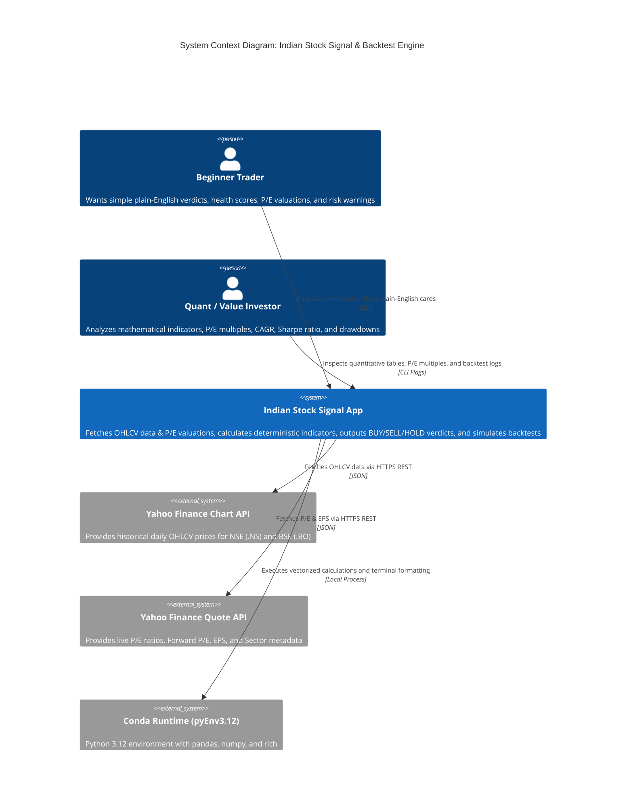

# Indian Equities Deterministic Stock Signal & Backtest Engine

A rule-based, non-LLM quantitative stock analysis and backtesting application designed specifically for Indian equities (NSE & BSE). It resolves stock symbols or company names, fetches historical daily OHLCV market data without look-ahead bias, pulls fundamental P/E valuation metrics, computes mathematical indicators, evaluates multi-condition composite trading strategies, and outputs actionable **"BUY"**, **"SELL"**, or **"HOLD"** signals with a dual beginner-friendly dashboard and detailed quantitative metrics.

---

## C4 System Context Model

### 1. System Overview

#### Short Description
A deterministic Python quantitative analysis and backtesting tool for Indian equities providing plain-English trade recommendations, P/E fundamental valuation context, and statistical performance metrics without LLM hallucinations.

#### Long Description
In modern retail trading, beginners and quantitative analysts face two extremes: overly complex statistical charts or unreliable, hallucinated AI predictions. This application bridges that gap by running a **100% deterministic mathematical pipeline**. 
It resolves Indian stock names or symbols (e.g., "Reliance", "IOC", "TCS"), downloads historical bar data directly from market data feeds, checks technical indicators (Trend, RSI, MACD, Bollinger Bands), integrates fundamental **P/E valuation ratios** against industry peers and 5-year averages, and calculates a **Stock Health Score** (0–100) and **Algorithm Confidence Score** (0–100%). It simultaneously simulates a 3-year historical backtest against Buy & Hold, calculating CAGR, Maximum Drawdown, and Annualized Sharpe Ratio calibrated to Indian risk-free interest rates ($R_f = 6.5\%$).

---

### 2. Personas

#### Persona 1: Beginner / Retail Trader
- **Type:** Human User
- **Description:** A beginner investor or retail trader looking for clear guidance on whether a stock is a safe buy, without needing to decipher candlestick formulas or moving average math.
- **Goals:** Understand instantly whether to Buy, Sell, or Wait, learn what the stock's health and P/E valuation mean in plain English, and see how much ₹1,00,000 would have made historically.
- **Key Features Used:** Beginner Summary Card, Traffic-Light Verdicts, Plain-English Checklist, P/E Valuation Status, Real-Money Results, Confidence Score.

#### Persona 2: Quantitative Analyst / Value Investor
- **Type:** Technical User
- **Description:** A trader, developer, or value investor testing rule-based technical strategies combined with fundamental valuation across Indian equities over customizable lookback horizons.
- **Goals:** Inspect raw mathematical indicator values (EMA 20/50, RSI 14, MACD 12/26/9, Bollinger Bands), verify P/E multiples (TTM P/E, Forward P/E, Sector P/E, 5-Year Average P/E), and analyze risk metrics (Max Drawdown, Sharpe ratio, Win Rate).
- **Key Features Used:** CLI flags (`--symbol`, `--period`, `--exchange`, `--hide-advanced`), Quantitative Tables, Valuation Matrix, Trade Execution Logs, Multi-index data ingestion.

---

### 3. System Features

| Feature Name | Description | Target Persona |
| :--- | :--- | :--- |
| **Indian Ticker Resolution** | Automatically maps company names and adds `.NS` (NSE) or `.BO` (BSE) exchange suffixes. | All Users |
| **Direct Market Ingestion** | Fetches historical OHLCV data using direct Yahoo Finance chart API with custom browser headers to prevent rate limits. | All Users |
| **Fundamental P/E Valuation Engine** | Fetches live Trailing P/E, Forward P/E, EPS, and benchmarks against Sector Average P/E and 5-Year Historical Average P/E. | All Users |
| **Deterministic Indicator Engine** | Vectorized computation of EMA (20, 50), SMA (200), RSI (14 with Wilder smoothing), MACD (12, 26, 9), and Bollinger Bands. | Quant / Technical |
| **Multi-Condition Composite Strategy** | Combines Trend Alignment, Momentum Confirmation, and Volatility Boundaries to generate discrete BUY, SELL, or HOLD transitions. | All Users |
| **Beginner Translation Layer** | Converts math into a 0–100 Health Score, a 0–100% Confidence Score, and plain-English checklists. | Beginner Trader |
| **Vectorized Backtesting Engine** | Simulates 3-year execution curves, CAGR, Sharpe Ratio ($R_f=6.5\%$), and trade logs compared to Buy & Hold. | All Users |

---

### 4. User Journeys

#### Journey 1: Beginner Seeking Stock Guidance
1. **Input:** User runs `python main.py --symbol IOC` or enters `IOC` in interactive mode.
2. **Resolution:** System maps `IOC` $\rightarrow$ `IOC.NS` (Indian Oil Corporation).
3. **Fetching & Evaluation:** System fetches 3 years of daily trading data, queries fundamental P/E data, and calculates technical indicators.
4. **Beginner Card Display:** User sees `🟡 WAIT & WATCH (DO NOT BUY YET)` with a `55% Confidence Score`, Health Score of `52/100 (Neutral / Watch Closely)`, and note: `✅ P/E Valuation: Attractive / Undervalued (P/E 5.4 vs Sector 9.5)`.
5. **Actionable Takeaway:** User reads specific advice: *"If you are looking to BUY: Be patient... If you already OWN shares: Watch lower support level."*

#### Journey 2: Quant Analyst Evaluating Backtest Performance
1. **Input:** Analyst runs `python main.py --symbol TCS --period 3y`.
2. **Analysis:** Strategy evaluates 3 years of daily bars with transaction friction (0.1%) and fetches valuation benchmarks.
3. **Output Review:** Analyst inspects the Fundamental Valuation Table (Current P/E: 15.1 vs. Sector: 22.0) and the Quantitative Performance Table: Strategy CAGR vs. Buy & Hold CAGR, Max Drawdown mitigation, and historical win rate on closed trades.

---

### 5. External Systems and Dependencies

| External System | Type | Integration Type | Purpose |
| :--- | :--- | :--- | :--- |
| **Yahoo Finance Chart API** | External Market Feed | HTTPS REST API (`/v8/finance/chart`) | Supplies daily OHLCV historical price data for NSE and BSE equities. |
| **Yahoo Finance QuoteSummary API** | External Valuation Feed | HTTPS REST API (`/v10/finance/quoteSummary`) | Supplies Trailing P/E, Forward P/E, EPS, Sector, and Industry information with session cookie/crumb support. |
| **Python Conda Environment (`pyEnv3.12`)** | Execution Runtime | Local OS Process | Provides Python 3.12 interpreter and core libraries (`pandas`, `numpy`, `rich`, `requests`). |

---

### 6. System Context Diagram (C4 Context)



---

## How the Code Works (Internal Architecture)

```
MarketResearch/
│
├── main.py                   # CLI entry point, argument parsing & UI rendering
├── requirements.txt          # Python project dependencies
├── src/
│   ├── ticker_resolver.py    # Resolves Indian company names & symbols (.NS / .BO)
│   ├── data_loader.py        # Ingests OHLCV data via direct Yahoo Finance chart API
│   ├── fundamentals.py       # Live P/E, Sector/Industry P/E, 5-Yr Avg P/E & EPS
│   ├── indicators.py         # Pure vectorized mathematical indicators (No LLMs)
│   ├── strategy.py           # Multi-Condition Composite Strategy & signal logic
│   ├── backtester.py         # Vectorized portfolio simulation & risk metrics
│   └── formatters.py         # Plain-English translation, health & confidence scores
```

### Module Breakdown

#### 1. `ticker_resolver.py`
* **Problem Solved:** Users type informal names like `"Reliance"`, `"TCS"`, or `"Tata Motors"` without exchange suffixes.
* **Mechanism:** Maintains a dictionary of top Indian equities and automatically defaults unspecified symbols to `.NS` (National Stock Exchange) or `.BO` (Bombay Stock Exchange).

#### 2. `data_loader.py`
* **Problem Solved:** Standard `yfinance.download()` frequently hits HTTP 429 Rate Limits on Windows.
* **Mechanism:** Queries the Yahoo Finance v8 chart endpoint directly with custom browser user-agent headers. It converts timestamps to Indian Standard Time (IST), validates that at least 30 trading bars exist, and eliminates zero/NaN prices.

#### 3. `fundamentals.py` (New Valuation Engine)
* **Problem Solved:** Technical signals alone cannot tell if a stock is dangerously overvalued or a generational bargain.
* **Mechanism:** 
  * Queries Yahoo Finance `/v10/finance/quoteSummary` with session crumb authentication.
  * Retrieves **Trailing P/E (TTM)**, **Forward P/E**, and **12-Month Trailing EPS**.
  * Benchmarks against curated **Sector / Industry P/E averages** (e.g. Energy: 9.5–12.5, IT Services: 22.0–28.0, Banking: 16.5–18.0, FMCG: 52.0).
  * Compares against **5-Year Historical Average P/E** baselines for top Indian market leaders.

#### 4. `indicators.py`
* **Vectorized Technical Math:**
  * **20 & 50 EMA:** Exponential moving averages measuring short-to-medium trend direction.
  * **200 SMA:** Long-term institutional trend benchmark.
  * **RSI (14):** Wilder smoothed Relative Strength Index measuring buying vs. selling pressure.
  * **MACD (12, 26, 9):** Fast/Slow EMA difference with 9-day signal line for trend momentum.
  * **Bollinger Bands (20, 2):** Dynamic volatility boundaries around the 20-day moving average.
  * **ATR (14):** Average True Range for price volatility tracking.

#### 5. `strategy.py` (Multi-Condition Composite Strategy)
* **Zero Look-Ahead Bias:** Evaluates the state on bar $t$ using only data available up to bar $t$.
* **Buy Criteria:**
  $$\text{Bullish Trend (EMA20 > EMA50)} \ \land \ \text{Bullish MACD} \ \land \ \text{Healthy RSI } (35 \le \text{RSI} \le 65)$$
  *(Or Mean-Reversion Bounce: Price touches lower Bollinger Band with recovering RSI).*
* **Sell Criteria:**
  $$\text{Bearish Trend Cross} \ \lor \ (\text{Overheated RSI } > 70 \ \land \ \text{Upper Band Rejection}) \ \lor \ \text{Trend Breakdown with RSI } < 45$$
* **Hold State:** Retains previous position without unnecessary churn.

#### 6. `formatters.py` (Beginner Translation Engine)
* **Stock Health Score (0–100):** Aggregates 5 weighted factors:
  * Trend Alignment (30 points)
  * Buying vs. Selling Pressure (20 points)
  * Speed & Momentum (20 points)
  * Volatility Band (10 points)
  * **P/E Valuation Discount / Premium (20 points)**
* **Confidence Score (0–100%):** Measures technical and valuation convergence.
* **Real-Money Translator:** Converts percentage backtest returns into tangible ₹ terms based on a ₹1,00,000 starting portfolio.

#### 7. `backtester.py`
* **Simulation Mechanics:** Computes returns shifted by 1 bar ($\text{Return}_t \times \text{Position}_{t-1}$) to simulate realistic next-day execution without peek-ahead bias.
* **Friction:** Deducts 0.1% transaction costs on every position transition.
* **Metrics:** Calculates CAGR, Maximum Drawdown (peak-to-trough drop), Annualized Sharpe Ratio ($R_f=6.5\%$), and trade-by-trade win rate.

---

## Installation & Usage Guide

### Prerequisites
* Conda environment `pyEnv3.12` with Python 3.12.
* Dependencies installed via `requirements.txt`:
  ```bash
  pip install -r requirements.txt
  ```

### Running the Application

```bash
# Analyze any Indian stock by symbol or name (Default view: Beginner Summary + P/E + Technical Tables):
python main.py --symbol IOC --period 3y
python main.py --symbol TCS --period 3y
python main.py --symbol RELIANCE --period 3y

# Beginner-Only View (Hides the technical & backtesting tables):
python main.py --symbol INFY --hide-advanced

# Change historical lookback period (e.g., 1y, 3y, 5y):
python main.py --symbol TATAMOTORS --period 1y

# Interactive Prompt Mode:
python main.py
```

---

## Live Output Sample (with P/E Valuation)

When running for **Indian Oil Corporation (`IOC`)**:

```text
EASY SUMMARY FOR BEGINNERS: IOC (IOC.NS)
🟡 WAIT & WATCH (DO NOT BUY YET)

• Current Share Price: ₹131.34
• Stock Overall Health Score: 52/100 (Neutral / Watch Closely)
• Algorithm Confidence Score: 55% Confidence

👉 If you are looking to BUY: Be patient. The stock has not confirmed a clear upward turnaround yet.
👉 If you already OWN shares: If you are already holding, watch the lower support level closely.

🔍 Plain-English Breakdown of Key Factors:
  ❌ Short-Term Trend: Strongly Falling (Price is sliding down below recent averages)
  ℹ️ Buying Pressure: Moderate / Recovering (Balanced interest between buyers and sellers)
  ❌ Speed & Momentum: Downward Momentum (Sellers are currently driving the speed of decline)
  ✅ Price Stability: Normal Volatility Band (Trading safely between ₹131.15 and ₹138.98)
  ✅ P/E Valuation: Attractive / Undervalued (P/E 5.4) (Trading well below sector 9.5 & 5-yr avg 7.8)

💰 Historical Results in Real Money Terms (Last 3 Years on ₹1,00,000):
  • If you started with: ₹100,000 three years ago
  • Your money today using this strategy: ₹109,290 (+₹9,290 / +9.3%)
  • If you just bought & never touched it (Buy & Hold): ₹145,933 (+₹45,933)
  • Trade Success Rate: 61% of closed trades made money (11 out of 18 trades won)
  • Risk Protection: The worst temporary drop was -32.5% (Compared to -41.0% for Buy & Hold)

Fundamental Valuation Metrics:
  • Current P/E (TTM): 5.37
  • Forward P/E: 6.97
  • Sector Average P/E: 9.5 (Energy - Oil & Gas Refining)
  • 5-Year Historical Avg P/E: 7.8
  • Trailing 12M EPS: ₹24.44
```
