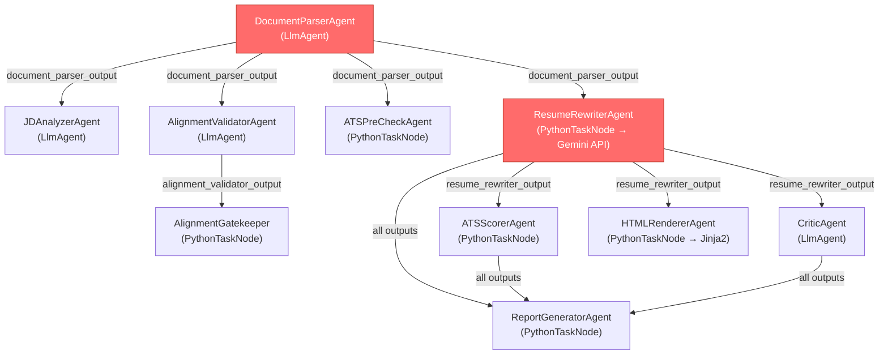

# Resume Parsing Fix Plan — Anti-Truncation & Header Synonym Remediation

> **Status:** 🟡 AWAITING APPROVAL — No code changes have been made.
> **Bug:** Multi-page resumes drop older job entries; non-standard section headers (e.g., "SELECTED PROJECTS") are silently ignored.
> **Root Cause:** LLM context truncation during extraction + prompt ambiguity in section identification.

---

## 1. Impact Analysis

The document parser's output (`document_parser_output`) is the **foundational data contract** consumed by 8 downstream agents. Any data loss at this stage silently cascades through the entire pipeline.

### 1.1 Data Flow Map



### 1.2 Files Requiring Modification

| # | File | Agent/Role | Why It Needs Changes |
|---|------|-----------|---------------------|
| 1 | [agent.py](file:///e:/GitHub/Python-Dev/agent-development-kit-crash-course/Resume_Builder/resume_optimizer/sub_agents/document_parser/agent.py) | DocumentParserAgent | **PRIMARY FIX TARGET.** The `INSTRUCTION` prompt is the root cause. It lacks: (a) explicit anti-truncation directives, (b) synonym mapping for non-standard headers, (c) a `projects` field in the output schema, and (d) a self-verification step. |
| 2 | [tools.py](file:///e:/GitHub/Python-Dev/agent-development-kit-crash-course/Resume_Builder/resume_optimizer/sub_agents/document_parser/tools.py) | Parser Tools | `parse_pdf()` joins pages with `\n`. No page boundary markers are injected, so the LLM cannot distinguish page breaks. Adding `--- PAGE BREAK ---` delimiters will help the LLM understand that content continues beyond page 1. |
| 3 | [state.py](file:///e:/GitHub/Python-Dev/agent-development-kit-crash-course/Resume_Builder/resume_optimizer/shared/state.py) | State Schema | The `DOCUMENT_PARSER_OUTPUT` contract comment must be updated to reflect the new `projects` field and the expanded `experience` array structure. |
| 4 | [agent.py](file:///e:/GitHub/Python-Dev/agent-development-kit-crash-course/Resume_Builder/resume_optimizer/sub_agents/resume_rewriter/agent.py) | ResumeRewriterAgent | Iterates over `orig_resume.get("experience", [])`. If `projects` entries are mapped into `experience`, the rewriter's `UNRELATED EXPERIENCE SAFEGUARD` rule must be updated to also handle project entries (which lack traditional company/title structure). The `SingleExperienceSchema` needs an optional `entry_type` discriminator. |
| 5 | [agent.py](file:///e:/GitHub/Python-Dev/agent-development-kit-crash-course/Resume_Builder/resume_optimizer/sub_agents/alignment_validator/agent.py) | AlignmentValidatorAgent | Reads experience from conversation history to infer seniority. If older roles are missing, seniority inference is skewed. No code change needed here — fixing the parser fixes this transitively. |
| 6 | [agent.py](file:///e:/GitHub/Python-Dev/agent-development-kit-crash-course/Resume_Builder/resume_optimizer/sub_agents/ats_precheck/agent.py) | ATSPreCheckAgent | Uses `raw_text` from parser output for keyword scoring. No structural change needed — the `raw_text` field already captures all text. But the `experience` array truncation means the pre-check's keyword coverage calculation could under-report matches. Fixing the parser fixes this. |
| 7 | [agent.py](file:///e:/GitHub/Python-Dev/agent-development-kit-crash-course/Resume_Builder/resume_optimizer/sub_agents/ats_scorer/agent.py) | ATSScorerAgent | Iterates `rewritten_resume.get("experience", [])` to build combined text. If experiences were dropped at parse time, they're absent here. Transitive fix. |
| 8 | [agent.py](file:///e:/GitHub/Python-Dev/agent-development-kit-crash-course/Resume_Builder/resume_optimizer/sub_agents/html_renderer/agent.py) | HTMLRendererAgent | Passes `experience` array to Jinja2 template. Transitive fix, but the template may also need a `projects` section rendering block. |
| 9 | [resume.html](file:///e:/GitHub/Python-Dev/agent-development-kit-crash-course/Resume_Builder/resume_optimizer/sub_agents/html_renderer/templates/resume.html) | Jinja2 Template | Needs a `` conditional in the experience rendering loop. |
| 10 | [agent.py](file:///e:/GitHub/Python-Dev/agent-development-kit-crash-course/Resume_Builder/resume_optimizer/sub_agents/critic/agent.py) | CriticAgent | Compares original vs. rewritten experience. If the original was truncated, fabrication detection will false-positive on entries that were actually in the resume but dropped by the parser. Transitive fix. |

> [!IMPORTANT]
> **6 of 10 files are transitively fixed** by solving the problem at the source (DocumentParserAgent). Only files **#1, #2, #3, #4** require direct code changes. Files **#8 and #9** need changes only if we decide to add a dedicated `projects` section to the output.

---

## 2. Strategy

Two orthogonal problems require two distinct strategies:

### 2.1 Anti-Truncation Strategy (Preventing Dropped Roles)

**Root Cause Diagnosis (per `llm-prompt-optimizer` RSCIT Framework):**

| Problem | Symptom | Root Cause |
|---------|---------|------------|
| Truncation | 7-role resume outputs only 3-4 roles | Prompt lacks **Constraints** block. The LLM is satisfying the instruction with "representative" output, not exhaustive extraction. No verification step. |
| No structure | LLM sometimes outputs partial JSON | Template section shows example schema but doesn't **mandate** exhaustive enumeration. |
| Inconsistent | Different runs produce different role counts | No **few-shot anchoring** or count-verification step. |

**Fix — Apply RSCIT + Chain-of-Thought countermeasures:**

1. **Explicit Exhaustive Constraint (C in RSCIT):**
   ```
   CRITICAL ANTI-TRUNCATION RULE:
   You MUST extract EVERY role, position, project, and employment entry 
   from the resume. Count the total number of distinct entries you find, 
   then verify your output contains exactly that many objects in the 
   experience array. If your output has fewer entries than the source 
   text, your extraction has FAILED — go back and add the missing entries.
   ```

2. **Chain-of-Thought Verification Step:**
   ```
   Before generating your final JSON, perform this internal check:
   Step 1: Count the number of distinct job/role/project headers in the raw text.
   Step 2: Count the number of objects in your experience array.
   Step 3: If Step 1 ≠ Step 2, you have truncated data. Add the missing entries.
   Report the count as: "experience_entry_count": <N>
   ```

3. **Page-Boundary Markers in Raw Text (tooling fix):**
   Modify `parse_pdf()` to inject `\n--- PAGE 2 OF N ---\n` between pages. This gives the LLM an explicit signal that content continues.

4. **Structured Output Enforcement (per `llm-structured-output` skill):**
   Add `experience_entry_count: int` field with description `"Total number of experience entries extracted. Must match the actual array length."` to use as a cross-check assertion in downstream code.

### 2.2 Header Synonym Mapping (Capturing "SELECTED PROJECTS", etc.)

**Root Cause:** The prompt lists only canonical section names (`experience`, `skills`, etc.). Resumes use dozens of synonymous headers. The LLM silently drops sections it can't confidently categorize.

**Fix — Explicit Synonym Map in the Prompt:**

```
## Section Header Synonym Map
Map ALL of these resume headers to the corresponding canonical section:

| Canonical Section | Accepted Headers (case-insensitive) |
|---|---|
| experience | "Work Experience", "Professional Experience", "Employment History", "Career History", "Relevant Experience", "Work History" |
| experience | "SELECTED PROJECTS", "Key Projects", "Project Experience", "Projects", "Consulting Engagements", "Freelance Work", "Contract Work", "Volunteer Experience", "Leadership Experience" |
| skills | "Technical Skills", "Core Competencies", "Areas of Expertise", "Proficiencies", "Technologies", "Tools & Technologies", "Tech Stack" |
| education | "Education", "Academic Background", "Qualifications", "Training", "Academic Credentials" |
| certifications | "Certifications", "Licenses", "Professional Development", "Credentials", "Certificates" |
| summary | "Summary", "Profile", "Objective", "Professional Summary", "Executive Summary", "About Me", "Career Objective" |
| contact | "Contact", "Contact Information", "Personal Information" |

ANY section header NOT in this table should still be extracted — place it in 
the closest matching canonical section. If no match is found, include it as 
an additional entry in the experience array with entry_type: "other".
```

> [!WARNING]
> **Design Decision Required:** Should "SELECTED PROJECTS" map into the `experience` array (as entries with `entry_type: "project"`), or should we add a new top-level `projects` field to the output schema?
> 
> **Recommendation:** Map into `experience` with a discriminator field. This avoids schema changes across 8 downstream consumers and ensures projects get rewritten, scored, and rendered alongside jobs. The rewriter already iterates `experience[]` — adding a discriminator is additive, not breaking.

---

## 3. The Roadmap — Atomic Action Items

### Approach
Fix the data-loss bug at its source (Agent 1) and propagate minimal schema updates downstream. Use the RSCIT prompt framework to rewrite the parser instruction, inject page-boundary markers at the tooling level, and add a self-verification chain-of-thought step to prevent the LLM from truncating output.

### Scope
- **In:** Parser prompt rewrite, PDF tool page markers, schema discriminator field, rewriter safeguard update, Jinja2 template update, validation tests.
- **Out:** Migrating parser to `PythonTaskNode`, changing the pipeline topology, modifying JD Analyzer or Alignment Validator prompts.

### Action Items

- [ ] **Step 1: Inject page-boundary markers in `parse_pdf()`.**
  - File: [tools.py](file:///e:/GitHub/Python-Dev/agent-development-kit-crash-course/Resume_Builder/resume_optimizer/sub_agents/document_parser/tools.py)
  - Change: Replace `"\n".join(text_parts)` with a loop that inserts `\n\n--- PAGE {i+1} OF {total_pages} ---\n\n` between each page's text. This gives the LLM an unambiguous signal that content continues across pages.

- [ ] **Step 2: Add `entry_type` discriminator to experience schema objects.**
  - File: [agent.py](file:///e:/GitHub/Python-Dev/agent-development-kit-crash-course/Resume_Builder/resume_optimizer/sub_agents/resume_rewriter/agent.py)
  - Change: Add `entry_type: str = "job"` to both `ExperienceSchema` and `SingleExperienceSchema` with description `"Type of entry: 'job', 'project', 'volunteer', or 'other'"`. This lets downstream agents distinguish project entries from job entries.

- [ ] **Step 3: Add `experience_entry_count` to parser output schema.**
  - File: [agent.py](file:///e:/GitHub/Python-Dev/agent-development-kit-crash-course/Resume_Builder/resume_optimizer/sub_agents/document_parser/agent.py)
  - Change: Add `"experience_entry_count": <integer>` to the JSON output template. Add field description: `"Total number of experience entries (jobs + projects + other) extracted. Must equal len(experience)."` This enables downstream assertions.

- [ ] **Step 4: Rewrite the DocumentParserAgent INSTRUCTION using RSCIT framework.**
  - File: [agent.py](file:///e:/GitHub/Python-Dev/agent-development-kit-crash-course/Resume_Builder/resume_optimizer/sub_agents/document_parser/agent.py)
  - Changes:
    - **R (Role):** Keep existing role definition.
    - **S (Situation):** Add context about multi-page resumes and non-standard headers.
    - **C (Constraints):** Inject the **Anti-Truncation Rule** block (Section 2.1 above).
    - **I (Instructions):** Add the **Header Synonym Map** table (Section 2.2 above). Add the **Chain-of-Thought Verification Step** before final output.
    - **T (Template):** Update the JSON output template to include:
      - `entry_type` field in each experience object
      - `experience_entry_count` as a top-level integer
      - Field-level `description` strings (per `llm-structured-output` skill: "Never define schema fields without descriptions")

- [ ] **Step 5: Update the state schema documentation.**
  - File: [state.py](file:///e:/GitHub/Python-Dev/agent-development-kit-crash-course/Resume_Builder/resume_optimizer/shared/state.py)
  - Change: Update the `DOCUMENT_PARSER_OUTPUT` comment to reflect the new `experience_entry_count` field and the `entry_type` discriminator on experience objects.

- [ ] **Step 6: Update rewriter `UNRELATED EXPERIENCE SAFEGUARD` for project entries.**
  - File: [agent.py](file:///e:/GitHub/Python-Dev/agent-development-kit-crash-course/Resume_Builder/resume_optimizer/sub_agents/resume_rewriter/agent.py)
  - Change: Update `exp_prompt_template` to include:
    ```
    5. If this entry has entry_type "project", preserve the project framing. 
       Do NOT convert a project description into a job-role format.
    ```

- [ ] **Step 7: Add runtime assertion in rewriter for experience count.**
  - File: [agent.py](file:///e:/GitHub/Python-Dev/agent-development-kit-crash-course/Resume_Builder/resume_optimizer/sub_agents/resume_rewriter/agent.py)
  - Change: After the existing `assert len(orig_exp) == len(rewritten_experiences)` (line 152), add a comparison against `experience_entry_count` from the parser output:
    ```python
    expected = doc_out.get("experience_entry_count", len(orig_exp))
    assert len(orig_exp) == expected, (
        f"Parser truncation detected! Parser claimed {expected} entries "
        f"but only {len(orig_exp)} were found in the experience array."
    )
    ```

- [ ] **Step 8: Update Jinja2 template to render project entries distinctly.**
  - File: `sub_agents/html_renderer/templates/resume.html`
  - Change: Within the experience rendering loop, add a conditional check:
    ```html
    
      <h4>{{ exp.title }} — Project</h4>
    
      <h4>{{ exp.title }} | {{ exp.company }}</h4>
    
    ```
    This ensures projects aren't rendered with an empty "Company" field.

- [ ] **Step 9: Create a multi-page resume test fixture.**
  - File: `[NEW] tests/fixtures/multi_page_resume.txt`
  - Create a 7-entry, 2-page resume text fixture that includes:
    - 5 standard "EXPERIENCE" entries
    - 1 "SELECTED PROJECTS" entry
    - 1 "VOLUNTEER EXPERIENCE" entry
    - `--- PAGE 1 OF 2 ---` markers between pages
  - This fixture will be used for automated regression testing.

- [ ] **Step 10: Write integration test for zero-data-loss extraction.**
  - File: `[NEW] tests/test_parser_anti_truncation.py`
  - Test cases:
    1. **Count Preservation:** Parse the 7-entry fixture → assert `len(experience) == 7` AND `experience_entry_count == 7`.
    2. **Project Mapping:** Assert at least one entry has `entry_type == "project"`.
    3. **Page Boundary:** Assert the raw_text contains `--- PAGE` markers (verifying the tooling fix).
    4. **Synonym Header Capture:** Create a fixture with "SELECTED PROJECTS" header → assert it appears in the experience array, not silently dropped.

### Validation Plan

| Test | Type | How |
|------|------|-----|
| Multi-page count preservation | Automated | `test_parser_anti_truncation.py` — assert experience array length matches fixture |
| Header synonym mapping | Automated | Same test file — assert "SELECTED PROJECTS" captured as `entry_type: "project"` |
| Rewriter 1:1 guarantee | Automated | Existing assertion on line 152 of rewriter + new `experience_entry_count` cross-check |
| End-to-end pipeline | Manual | Run full pipeline via `positive_test_scenario_api.py` with a multi-page resume PDF |
| Regression on single-page resumes | Manual | Run existing test with a standard 1-page resume to verify no regressions |

---

## Open Questions

> [!IMPORTANT]
> **Q1: Schema Decision — `projects` as separate field or merged into `experience`?**
> My recommendation is to merge into `experience` with `entry_type: "project"`. This is additive (no breaking changes) and ensures projects flow through the rewriter and scorer. But if you want projects rendered in a visually distinct section on the HTML resume, a top-level `projects` field would be cleaner. **Which approach do you prefer?**

> [!IMPORTANT]
> **Q2: Should we enforce structured output via Gemini's `response_schema` for the parser?**
> Currently, the DocumentParserAgent is an `LlmAgent` that outputs free-form text containing a JSON block. Per the `llm-structured-output` skill, we could enforce output via `GenerateContentConfig(response_mime_type="application/json", response_schema=...)`, which activates constrained decoding. This would **guarantee** valid JSON but requires converting from `LlmAgent` to `PythonTaskNode` with a direct Gemini API call (like the rewriter). This is a bigger refactor — is it in scope?

> [!WARNING]
> **Q3: Context window sizing.**
> A 7-role, 2-page resume with full bullets can easily exceed 3,000 tokens of input. The parser's prompt itself is ~600 tokens. With `gemini-2.0-flash`'s 1M token context window, raw truncation by the model is unlikely — the more probable cause is the LLM **choosing** to abbreviate, not being **forced** to by context limits. The prompt fix (anti-truncation directives) should resolve this without needing to chunk the input. But if resumes exceed 5+ pages (e.g., academic CVs), we may need a chunked extraction strategy similar to the rewriter's map-reduce pattern. **Are academic CVs in scope?**
