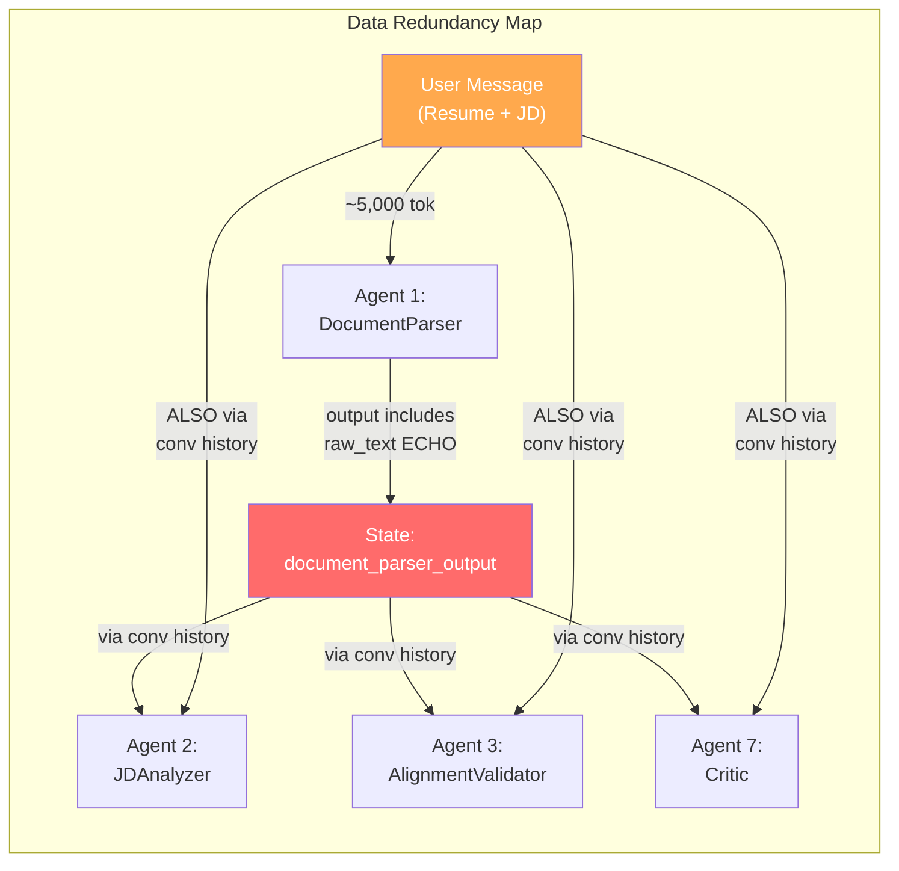

# 📊 Resume Optimizer v2 — FinOps Token Audit Report

**Date:** 2026-04-04  
**Scope:** `resume_optimizerv2/` — All 10 pipeline agents  
**Status:** 🔍 Architectural Review Only — No Code Changes

---

## Table of Contents

1. [Executive Summary](#executive-summary)
2. [Phase 1: The Token Audit](#phase-1-the-token-audit)
3. [Phase 2: Compression & Optimization Strategy](#phase-2-compression--optimization-strategy)
4. [Phase 3: Advanced Caching Strategy](#phase-3-advanced-caching-strategy)
5. [Prioritized Implementation Roadmap](#prioritized-implementation-roadmap)

---

## Executive Summary

The pipeline makes **between 6 and N+4 LLM API calls** per run (where N = number of experience entries), with the **Resume Rewriter alone responsible for N+2 calls**. For a typical 5-entry resume, that's **11 LLM calls per pipeline execution**. The primary token cost drivers are:

| Rank | Issue | Est. Waste per Run |
|------|-------|--------------------|
| 🔴 1 | Conversation history snowball across LLM agents | ~40-60% of total input tokens |
| 🔴 2 | `raw_text` echoed in `document_parser_output` state | ~2,000-4,000 tokens duplicated |
| 🟠 3 | Resume Rewriter N+2 LLM calls with repeated context | ~1,500 tokens × N entries |
| 🟠 4 | Verbose `INSTRUCTION` prompts (Document Parser: 142 lines) | ~3,000+ tokens in system prompts |
| 🟡 5 | `get_dict_from_state()` duplicated across 5 files | Code debt, not direct token waste |
| 🟡 6 | Initial user message contains full resume + JD text | ~3,000-6,000 tokens, unavoidable but amplified |

**Estimated total savings potential: 35-55% of current token consumption.**

---

## Phase 1: The Token Audit

### 1.1 Pipeline Architecture Map

```
┌─────────────────────────────────────────────────────────────────────┐
│                    PIPELINE EXECUTION FLOW                          │
├─────────────────────────────────────────────────────────────────────┤
│                                                                     │
│  User Message (Resume + JD)                                         │
│       │                                                             │
│       ▼                                                             │
│  ┌─────────────────────┐                                            │
│  │ 1. DocumentParser   │ ◄── LLM Agent (gemini-2.0-flash)          │
│  │    output_key:      │     INSTRUCTION: 142 lines (~3,200 tok)   │
│  │    document_parser_  │     Tools: parse_resume_file              │
│  │    output           │     OUTPUT: JSON + raw_text echo           │
│  └────────┬────────────┘                                            │
│           │ writes to state + conversation history                  │
│           ▼                                                         │
│  ┌─────────────────────┐                                            │
│  │ 2. JDAnalyzer       │ ◄── LLM Agent (gemini-2.0-flash)          │
│  │    output_key:      │     INSTRUCTION: 87 lines (~1,400 tok)    │
│  │    jd_analyzer_     │     Tools: 3 deterministic tools           │
│  │    output           │     READS: conversation history (Agent 1)  │
│  └────────┬────────────┘                                            │
│           │ conversation history now contains Agent 1 + 2 outputs   │
│           ▼                                                         │
│  ┌─────────────────────┐                                            │
│  │ 3. AlignmentValid.  │ ◄── LLM Agent (gemini-2.0-flash)          │
│  │    output_key:      │     INSTRUCTION: 103 lines (~2,100 tok)   │
│  │    alignment_       │     Tools: 2 deterministic tools           │
│  │    validator_output │     READS: conversation history (1+2)      │
│  └────────┬────────────┘                                            │
│           │ history now contains Agent 1 + 2 + 3 outputs            │
│           ▼                                                         │
│  ┌─────────────────────┐                                            │
│  │ 3.5 AlignmentGate   │ ◄── PythonTaskNode (NO LLM call)          │
│  │    Deterministic    │     Reads state, raises if reject          │
│  └────────┬────────────┘                                            │
│           ▼                                                         │
│  ┌─────────────────────┐                                            │
│  │ 4. ATSPreCheck      │ ◄── PythonTaskNode (NO LLM call)          │
│  │    Deterministic    │     Reads doc_out + jd_out from state      │
│  └────────┬────────────┘                                            │
│           ▼                                                         │
│  ┌─────────────────────┐                                            │
│  │ 5. ResumeRewriter   │ ◄── PythonTaskNode with INTERNAL LLM      │
│  │    N+2 LLM calls!   │     1 × base rewrite (summary + skills)   │
│  │    via Client()     │     N × experience entry rewrites          │
│  │                     │     1 × changes summary generation         │
│  └────────┬────────────┘                                            │
│           ▼                                                         │
│  ┌─────────────────────┐                                            │
│  │ 6. ATSScorer        │ ◄── PythonTaskNode (NO LLM call)          │
│  │    Deterministic    │     Reads rewriter_out + jd_out            │
│  └────────┬────────────┘                                            │
│           ▼                                                         │
│  ┌─────────────────────┐                                            │
│  │ 7. Critic           │ ◄── LLM Agent (gemini-2.0-flash)          │
│  │    output_key:      │     INSTRUCTION: 68 lines (~1,200 tok)    │
│  │    critic_output    │     Tools: 2 deterministic tools           │
│  │                     │     READS: FULL conversation history       │
│  └────────┬────────────┘     (Agents 1+2+3+3.5+4+5+6 outputs!)    │
│           ▼                                                         │
│  ┌─────────────────────┐                                            │
│  │ 8. HTMLRenderer     │ ◄── PythonTaskNode (NO LLM call)          │
│  │    Deterministic    │     Reads rewriter_out from state          │
│  └────────┬────────────┘                                            │
│           ▼                                                         │
│  ┌─────────────────────┐                                            │
│  │ 9. ReportGenerator  │ ◄── PythonTaskNode (NO LLM call)          │
│  │    Deterministic    │     Reads ALL state keys                   │
│  └────────┘────────────┘                                            │
│                                                                     │
└─────────────────────────────────────────────────────────────────────┘
```

### 1.2 LLM Call Inventory

| # | Agent | Type | LLM Calls | Input Token Est. | Notes |
|---|-------|------|-----------|-------------------|-------|
| 1 | DocumentParser | `LlmAgent` | 1 (+ possible tool call) | ~6,000-10,000 | Receives full resume text in user message + 3,200-tok instruction |
| 2 | JDAnalyzer | `LlmAgent` | 1 + 3 tool calls | ~8,000-14,000 | Receives **full conversation history** (user msg + Agent 1 output) + 1,400-tok instruction |
| 3 | AlignmentValidator | `LlmAgent` | 1 + 2 tool calls | ~12,000-20,000 | Receives history of Agents 1+2 + 2,100-tok instruction |
| 3.5 | AlignmentGatekeeper | `PythonTaskNode` | 0 | 0 | Pure Python |
| 4 | ATSPreCheck | `PythonTaskNode` | 0 | 0 | Pure Python |
| 5 | ResumeRewriter | `PythonTaskNode` + internal `Client()` | **N+2** | ~2,000-3,500 per call | Map-reduce pattern, but `context_str` is repeated N times |
| 6 | ATSScorer | `PythonTaskNode` | 0 | 0 | Pure Python |
| 7 | Critic | `LlmAgent` | 1 + 2 tool calls | ~15,000-30,000 | **Worst case**: receives ENTIRE conversation history from all previous agents |
| 8 | HTMLRenderer | `PythonTaskNode` | 0 | 0 | Pure Python |
| 9 | ReportGenerator | `PythonTaskNode` | 0 | 0 | Pure Python |

**Total LLM calls per run: 4 ADK-managed + (N+2) direct = ~11 for a 5-entry resume**

### 1.3 The Five Critical Token Bloat Hotspots

#### 🔴 Hotspot 1: Conversation History Snowball Effect

> [!CAUTION]
> This is the single largest source of token waste in the pipeline.

In ADK's `SequentialAgent`, each `LlmAgent` receives the **entire conversation history** from all previous agents as input context. This means:

- **Agent 1** (DocumentParser): Sees the user message (~3,000-6,000 tokens)
- **Agent 2** (JDAnalyzer): Sees user message + Agent 1's full JSON output (including `raw_text`!)
- **Agent 3** (AlignmentValidator): Sees user message + Agent 1 output + Agent 2 output
- **Agent 7** (Critic): Sees user message + Agent 1 + Agent 2 + Agent 3 + Agent 3.5 + Agent 4 + Agent 5 + Agent 6 outputs

By Agent 7, the conversation history can easily reach **20,000-30,000+ input tokens**, even though the Critic only needs the original resume, the rewritten resume, and the JD keywords.

**Evidence from code:** Each LLM agent instruction says `"Read [X] from the conversation history above"` — confirming that agents rely on the snowballing history rather than targeted state reads.

#### 🔴 Hotspot 2: `raw_text` Echo in Document Parser Output

In [document_parser/agent.py](file:///e:/GitHub/Python-Dev/agent-development-kit-crash-course/Resume_Builder/resume_optimizerv2/sub_agents/document_parser/agent.py#L131), the output schema instructs the LLM to echo the **entire raw resume text** back in the JSON output:

```json
{
  "raw_text": "full extracted resume text here"  // ← THIS IS THE PROBLEM
}
```

This means the resume text exists in **three places simultaneously**:
1. The original user message (`[RESUME]\n...`)
2. The `raw_resume_text` state key (set by `main.py`)
3. The `document_parser_output.raw_text` field

Each copy is ~1,500-4,000 tokens. The third copy then propagates into the conversation history seen by Agents 2, 3, and 7 — **tripling the damage**.

#### 🟠 Hotspot 3: Resume Rewriter — Repeated Context in Map-Reduce

In [resume_rewriter/agent.py](file:///e:/GitHub/Python-Dev/agent-development-kit-crash-course/Resume_Builder/resume_optimizerv2/sub_agents/resume_rewriter/agent.py#L148-L178), the `context_str` (containing JD Title, Keywords, Missing Keywords) is injected into **every single experience entry's prompt**:

```python
exp_prompt_template = """
Rewrite the following single experience entry to maximize ATS fit.
Context:
{context}          # ← Repeated N times! (~200-400 tokens each)

Original Experience:
{exp}
...
"""
```

For a 5-entry resume, that's ~1,500-2,000 tokens of repeated context. Additionally, the **`exp_prompt_template` itself** (~160 tokens of static instruction text) is sent N times.

#### 🟠 Hotspot 4: Verbose Instruction Prompts

| Agent | Instruction Lines | Est. Tokens | Verbosity Issues |
|-------|-------------------|-------------|------------------|
| DocumentParser | **142 lines** | ~3,200 | Massive synonym table, redundant anti-truncation rules, full JSON example |
| AlignmentValidator | **103 lines** | ~2,100 | Repeats tool names that are already in tool definitions, redundant pipeline guard |
| JDAnalyzer | **87 lines** | ~1,400 | Clean, but includes full JSON output example |
| Critic | **68 lines** | ~1,200 | Reasonably efficient |

The Document Parser instruction alone contains:
- A 7-row synonym mapping table (~400 tokens) that could be a deterministic pre-processing step
- A full 40-line JSON example (~500 tokens) when a compact schema reference would suffice
- Redundant rules (anti-truncation is stated 3 times in different ways)

#### 🟡 Hotspot 5: Duplicated `get_dict_from_state()` Utility

The same JSON extraction function is **copy-pasted across 5 files**:
- `ats_precheck/agent.py`
- `resume_rewriter/agent.py`
- `ats_scorer/agent.py`
- `html_renderer/agent.py`
- `report_generator/agent.py`

While this doesn't directly waste LLM tokens, it's a maintenance hazard leading to inconsistent extraction strategies (the `report_generator` version uses a **non-greedy** regex while others use **greedy** — the exact bug you fixed in a previous conversation).

### 1.4 Redundant Data Flow Analysis



**The resume text is effectively sent to the LLM 8+ times across the pipeline.** The JD text follows the same pattern.

---

## Phase 2: Compression & Optimization Strategy

*Applied skills: [@context-compression](file:///C:/Users/Dell/.gemini/antigravity/skills/context-compression/SKILL.md) and [@llm-prompt-optimizer](file:///C:/Users/Dell/.gemini/antigravity/skills/llm-prompt-optimizer/SKILL.md)*

### 2.1 State Payload Compression

#### Strategy A: Eliminate `raw_text` from Document Parser Output

**Current:** The Document Parser LLM is instructed to echo the full resume text in `raw_text`.

**Proposed:** Remove `raw_text` from the LLM output schema entirely. The raw text already exists in:
- `state["raw_resume_text"]` (set by `main.py` line 261)
- The original user message

Downstream agents that need raw text (`ats_precheck`) should read from `state["raw_resume_text"]` directly.

| Metric | Before | After |
|--------|--------|-------|
| `document_parser_output` size | ~4,000-8,000 tok | ~1,500-3,000 tok |
| Savings per run | — | **~3,000-5,000 tokens** |

#### Strategy B: Convert LLM Agents to State-Reading PythonTaskNodes

> [!IMPORTANT]
> This is the highest-impact architectural change.

Currently, Agents 2 (JDAnalyzer), 3 (AlignmentValidator), and 7 (Critic) are `LlmAgent` instances that read upstream data **from the conversation history**. This forces the ADK framework to pass the entire snowballing history as input.

**Proposed conversion strategy:**

| Agent | Current Type | Proposed Type | LLM Still Needed? |
|-------|-------------|---------------|-------------------|
| JDAnalyzer | `LlmAgent` (tool-calling + synthesis) | `PythonTaskNode` with internal `Client()` calls | Yes, but with **surgically scoped prompts** |
| AlignmentValidator | `LlmAgent` (tool-calling + decision) | `PythonTaskNode` with deterministic logic | **No** — tools are deterministic, decision is rule-based |
| Critic | `LlmAgent` (tool-calling + comparison) | `PythonTaskNode` with internal `Client()` call | Yes, but only for fabrication detection |

**AlignmentValidator is fully deterministic today.** Its LLM call is wasted — the LLM's only job is to:
1. Read skills from conversation history → could read from `state["document_parser_output"]`
2. Call `compare_seniority_levels()` → deterministic function
3. Call `check_domain_alignment()` → deterministic function
4. Make a binary decision based on tool results → `if gap > 2 or overlap < 15: reject`

**Estimated savings from converting AlignmentValidator to PythonTaskNode:**
- Eliminates: ~12,000-20,000 input tokens + ~500 output tokens
- Zero quality loss (pure decision logic, no LLM reasoning needed)

#### Strategy C: Scoped Context for Critic Agent

The Critic currently reads the **entire conversation history** from Agents 1-6, but it only needs:
1. The original resume sections (from `document_parser_output`)
2. The rewritten resume (from `resume_rewriter_output`)
3. The JD keywords (from `jd_analyzer_output`)

If converted to a `PythonTaskNode` with internal `Client()` call:

```python
# Instead of receiving 20K+ tokens of conversation history:
critic_prompt = f"""
Compare these two resumes and detect fabrication, title inflation, or keyword stuffing.

ORIGINAL RESUME SKILLS: {json.dumps(orig_skills)}
ORIGINAL JOB TITLES: {json.dumps(orig_titles)}

REWRITTEN RESUME SKILLS: {json.dumps(new_skills)}
REWRITTEN JOB TITLES: {json.dumps(new_titles)}

JD KEYWORDS: {json.dumps(jd_keywords)}
"""
# Estimated: ~800-1,200 tokens instead of ~20,000+
```

| Metric | Before | After |
|--------|--------|-------|
| Critic input tokens | ~15,000-30,000 | ~800-1,200 |
| Savings | — | **~14,000-29,000 tokens** |

#### Strategy D: Compress JDAnalyzer to Hybrid Approach

The JDAnalyzer's three tools (`check_jd_authenticity`, `extract_seniority_signals`, `extract_job_metadata`) are **all deterministic Python functions**. The only LLM-dependent work is:
- Extracting the job title from text
- Separating required vs preferred skills
- Extracting core responsibilities

**Proposed:** Convert to `PythonTaskNode`, run the three deterministic tools directly, then make a single focused `Client()` call for only the LLM-dependent extraction:

```python
# Deterministic: run tools directly
auth = check_jd_authenticity(jd_text)
seniority = extract_seniority_signals(jd_text)
metadata = extract_job_metadata(jd_text)

# Single focused LLM call with ONLY the JD text (~800-2000 tok)
llm_result = client.generate_content(
    prompt=f"Extract job_title, required_skills, preferred_skills, core_responsibilities from:\n{jd_text}",
    config=...
)
```

| Metric | Before | After |
|--------|--------|-------|
| JDAnalyzer input tokens | ~8,000-14,000 | ~2,000-4,000 |
| Savings | — | **~6,000-10,000 tokens** |

### 2.2 Instruction Prompt Optimization

*Applied: [@llm-prompt-optimizer](file:///C:/Users/Dell/.gemini/antigravity/skills/llm-prompt-optimizer/SKILL.md) — RSCIT Framework + Compression Techniques*

#### Document Parser Instruction — Before vs. After

**Current:** 142 lines, ~3,200 tokens

**Optimized version using RSCIT + compression:**

```
Role: Resume parser extracting structured JSON from raw text.

Input: Resume text from user message under [RESUME] header or state["raw_resume_text"]. 
NEVER call parse_resume_file if text is present.

Task: Extract all sections into JSON. Multi-page resumes use "--- PAGE X OF Y ---" markers — extract ALL pages.

Sections to extract:
- contact: {name, email, phone, location, linkedin}
- summary: professional summary text
- experience: [{title, company, dates, bullets[], entry_type}] — entry_type: "job"|"project"|"volunteer"|"other"  
- skills: [string array]
- education: [{degree, institution, year}]
- certifications: [string array, may be empty]

Map non-standard headers to canonical sections (e.g., "Career History" → experience, "Core Competencies" → skills).

Verification: Count experience entries in source vs. output. Mismatch = extraction failure.

Completeness: Required sections = contact, experience, skills. Missing any → completeness_status: "fail".

Output: Single JSON block matching document_parser_output schema. Do NOT include raw_text.
```

**Estimated: ~50 lines, ~800 tokens — a 75% reduction.**

Key changes:
- Removed the 7-row synonym table (move to deterministic pre-processing or rely on LLM's native understanding)
- Removed the 40-line JSON example (schema is self-documenting)
- Removed triple-stated anti-truncation rules (stated once precisely)
- Removed `raw_text` from output
- Compressed verbose descriptions into terse directives

#### AlignmentValidator Instruction — Eliminate Entirely

If converted to `PythonTaskNode` (Strategy B), the 103-line instruction is deleted entirely. **Savings: ~2,100 tokens.**

#### JDAnalyzer Instruction — Compressed

**Current:** 87 lines, ~1,400 tokens  
**Optimized (if keeping as LlmAgent):** ~40 lines, ~700 tokens

```
Role: JD analyzer extracting role requirements from job descriptions.

Input: JD text from user message under [JOB DESCRIPTION] header.

Steps:
1. Call check_jd_authenticity(jd_text)
2. Call extract_seniority_signals(jd_text) 
3. Call extract_job_metadata(jd_text)
4. Extract: job_title, required_skills[], preferred_skills[], top_keywords[20], core_responsibilities[5]

Output: Single JSON matching jd_analyzer_output schema.
```

#### Critic Instruction — Compressed

**Current:** 68 lines, ~1,200 tokens  
**Optimized:** ~35 lines, ~600 tokens

### 2.3 Summary: Compression Savings Table

| Optimization | Token Savings (Input) | Token Savings (Output) | Difficulty |
|-------------|----------------------|----------------------|------------|
| A: Remove `raw_text` echo | 3,000-5,000 | 1,500-4,000 | 🟢 Easy |
| B: AlignmentValidator → PythonTaskNode | 12,000-20,000 | 500 | 🟢 Easy |
| C: Critic → scoped PythonTaskNode | 14,000-29,000 | ~0 | 🟡 Medium |
| D: JDAnalyzer → hybrid PythonTaskNode | 6,000-10,000 | ~0 | 🟡 Medium |
| E: Compress DocumentParser instruction | 2,400 | ~0 | 🟢 Easy |
| F: Compress remaining instructions | 1,100 | ~0 | 🟢 Easy |
| **TOTAL** | **~38,500-67,500** | **~2,000-4,500** | — |

---

## Phase 3: Advanced Caching Strategy

*Applied skill: [@prompt-caching](file:///C:/Users/Dell/.gemini/antigravity/skills/prompt-caching/SKILL.md)*

### 3.1 Caching Opportunity Assessment

| Cacheable Content | Size (tokens) | Frequency per Run | Cache Type | Provider Support |
|-------------------|--------------|-------------------|------------|------------------|
| System instructions (per agent) | 800-3,200 | 1× per agent | **Prefix Cache** | ✅ Gemini (implicit), ✅ Anthropic (explicit) |
| JD text | 800-2,000 | Used by 5 agents | **Shared Context Cache** | ⚠️ Requires architectural change |
| Resume text | 1,500-4,000 | Used by 4 agents | **Shared Context Cache** | ⚠️ Requires architectural change |
| Rewriter `exp_prompt_template` | ~160 | N times per run | **Prefix Cache** | ✅ Gemini (implicit) |
| Rewriter `context_str` | ~300 | N times per run | **Prefix Cache** | ✅ Gemini (implicit) |
| Deterministic tool results | Varies | 1× per tool | **Response Cache** | ✅ Application-level |

### 3.2 Strategy 1: System Instruction Prefix Caching (Low Effort, Medium Impact)

Gemini 2.0 Flash applies implicit prefix caching. However, the current architecture **undermines this** because instruction content changes position relative to the growing conversation history.

**Recommendation:** If you stay with `LlmAgent`, ensure system instructions are sent as the `system_instruction` parameter (which ADK already does correctly). However, the growing conversation history between the system instruction and the actual query dilutes the cache hit ratio.

**Better approach:** Convert to `PythonTaskNode` + `Client()` calls where you control the prompt structure entirely. This lets you place static content (instructions + JD text + resume summary) as a fixed prefix:

```python
# Cache-optimized prompt structure for Rewriter:
static_prefix = f"""
You are a resume rewriter maximizing ATS fit.

JD Context:
Title: {jd_title}
Keywords: {keywords_csv}
Missing: {missing_csv}

Rules:
1. Never fabricate.
2. Upgrade weak verbs.
3. Preserve entry_type.
"""
# ↑ This prefix is identical across all N experience calls.
# Gemini's implicit KV-cache will cache this prefix after the first call.

# Only the dynamic suffix changes per call:
dynamic_suffix = f"Rewrite this entry:\n{json.dumps(exp)}"
```

**Estimated savings:** With Gemini's implicit caching, the ~460-token static prefix is cached after the first experience call, saving ~460 × (N-1) input tokens. For N=5: **~1,840 tokens saved**.

### 3.3 Strategy 2: JD Context Caching via State (Medium Effort, High Impact)

> [!IMPORTANT]
> This is the most impactful caching strategy and synergizes with Phase 2 recommendations.

Currently, the JD text flows through the pipeline as conversation history, re-parsed by every LLM agent. If you convert agents to `PythonTaskNode` + `Client()`, you can:

1. Parse the JD **once** (Agent 2)
2. Store the extracted structure in state (`jd_analyzer_output`)
3. All downstream agents read **only the structured fields they need** from state

This is effectively **Cache Augmented Generation (CAG)** — pre-processing the JD into a compact, structured representation that replaces the raw JD text for all downstream consumers.

| Consumer | Currently Reads | Should Read |
|----------|----------------|-------------|
| AlignmentValidator | Full JD text via conv history | `state["jd_analyzer_output"]["seniority_level"]` + `state["jd_analyzer_output"]["required_skills"]` |
| ATSPreCheck | `state["jd_analyzer_output"]["top_keywords"]` | ✅ Already optimized |
| ResumeRewriter | `state` (JD title + keywords + missing) | ✅ Already optimized |
| ATSScorer | `state["jd_analyzer_output"]["top_keywords"]` | ✅ Already optimized |
| Critic | Full JD text via conv history | `state["jd_analyzer_output"]["top_keywords"]` |

**The deterministic nodes (4, 5, 6, 8, 9) already practice good state hygiene.** It's only the `LlmAgent` nodes (1, 2, 3, 7) that waste tokens by reading the full conversation history.

### 3.4 Strategy 3: Deterministic Tool Response Caching (Low Effort, Low Impact)

Tool functions like `check_jd_authenticity()`, `extract_seniority_signals()`, and `detect_ats_unfriendly_formatting()` are pure functions — same input always produces same output.

If you convert JDAnalyzer to a `PythonTaskNode`, the tool results are computed once and stored in state. No need for an external cache layer since the state itself acts as the cache.

### 3.5 Strategy 4: Rewriter Batch Prompting (Medium Effort, Medium Impact)

> [!TIP]
> Instead of N separate LLM calls for N experience entries, consider batching.

**Option A: Batch 2-3 entries per call** — Reduces N calls to ⌈N/3⌉ calls while keeping output manageable:

```python
# Batch prompt:
batch_prompt = f"""
{static_prefix}

Rewrite each of these {len(batch)} experience entries. Return a JSON array.

{json.dumps(batch)}
"""
```

**Option B: Full batch** — All entries in one call. Risk: output truncation for long resumes.

| Approach | LLM Calls | Prefix Overhead | Truncation Risk |
|----------|-----------|-----------------|-----------------|
| Current (1 per entry) | N | N × 460 tok | None |
| Batch of 3 | ⌈N/3⌉ | ⌈N/3⌉ × 460 tok | Low |
| Full batch | 1 | 1 × 460 tok | Medium-High |

**Recommendation:** Batch of 2-3 entries for the best balance.

### 3.6 Anti-Patterns to Avoid

| Anti-Pattern | Why It's Dangerous | Mitigation |
|-------------|-------------------|------------|
| Caching full LLM responses for resume processing | Every resume + JD combination is unique | Cache only deterministic tool results |
| Caching with temperature > 0 | Non-deterministic outputs | Already using temp 0.2, good ✅ |
| No cache invalidation | Stale tool results if logic changes | State-based caching auto-invalidates per session |

---

## Prioritized Implementation Roadmap

### Tier 1: Quick Wins (1-2 hours, ~25% savings)

| # | Change | Est. Savings | Risk |
|---|--------|-------------|------|
| 1.1 | Remove `raw_text` from DocumentParser output schema | 3,000-5,000 tok | 🟢 Low — update `ats_precheck` to read from `state["raw_resume_text"]` |
| 1.2 | Compress DocumentParser instruction (142→50 lines) | ~2,400 tok | 🟢 Low |
| 1.3 | Compress JDAnalyzer + Critic instructions | ~1,100 tok | 🟢 Low |
| 1.4 | Extract `get_dict_from_state()` to `shared/utils.py` | 0 tok (code quality) | 🟢 Low |

### Tier 2: Architectural Wins (3-4 hours, ~40% savings)

| # | Change | Est. Savings | Risk |
|---|--------|-------------|------|
| 2.1 | Convert AlignmentValidator from LlmAgent → PythonTaskNode | 12,000-20,000 tok | 🟢 Low — logic is already deterministic |
| 2.2 | Convert JDAnalyzer to hybrid PythonTaskNode + focused Client() call | 6,000-10,000 tok | 🟡 Medium — must preserve extraction quality |
| 2.3 | Convert Critic to scoped PythonTaskNode + focused Client() call | 14,000-29,000 tok | 🟡 Medium — fabrication detection requires careful prompt design |

### Tier 3: Advanced Optimization (2-3 hours, ~10% additional savings)

| # | Change | Est. Savings | Risk |
|---|--------|-------------|------|
| 3.1 | Restructure Rewriter prompts for Gemini prefix caching | ~1,840 tok (for 5 entries) | 🟢 Low |
| 3.2 | Batch experience rewriting (groups of 2-3) | Reduces N+2 calls to ⌈N/3⌉+2 | 🟡 Medium — output schema changes |
| 3.3 | Eliminate Rewriter summary call (compute diff deterministically) | ~2,000-3,500 tok | 🟡 Medium |

### Estimated Total Impact

| Tier | Input Token Savings | LLM Calls Saved | Implementation Time |
|------|--------------------|-----------------|--------------------|
| Tier 1 | ~6,500-8,500 | 0 | 1-2 hours |
| Tier 2 | ~32,000-59,000 | 2 full LLM agent calls | 3-4 hours |
| Tier 3 | ~4,000-7,500 | ~2-3 calls | 2-3 hours |
| **Total** | **~42,500-75,000** | **4-5 calls** | **6-9 hours** |

> [!IMPORTANT]
> **The single highest-ROI change is Tier 2.1 — converting AlignmentValidator to a PythonTaskNode.** This is a zero-risk change that eliminates ~15,000 tokens per run because the agent's entire decision logic is already implemented as deterministic Python tool functions. The LLM is literally just calling two functions and reading their output.

---

*Report generated by FinOps Audit — Resume Optimizer v2 Pipeline*  
*Skills applied: @context-compression, @llm-prompt-optimizer, @prompt-caching*
