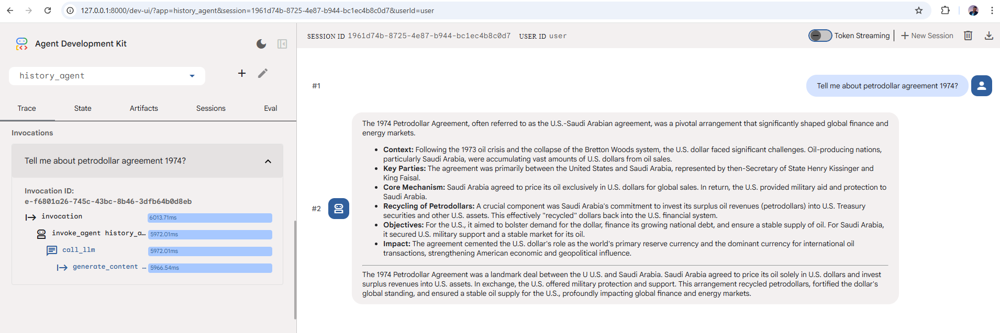

# 🏛️ History Agent

A minimal yet powerful AI agent built with **Google's Agent Development Kit (ADK)** that answers history-related questions with structured bullet-point summaries and a crisp 5-line conclusion.

---

## 📁 Project Structure

```
history_agent/
├── history_agent/
│   ├── __init__.py       # Exposes the agent module
│   ├── agent.py          # Agent definition (root_agent)
│   └── .env              # API key configuration
└── README.md
```

---

## 🧠 Understanding `agent.py`

```python
from google.adk.agents import LlmAgent

# Define the agent
root_agent = LlmAgent(
    name="history_agent",
    model="gemini-2.5-flash",
    instruction="When asked about a topic, summarize the answer in bullet points and provide a 5 lines crisp summary at the end",
    description="An agent that helps with history lessons",
)
```

### Parameter Breakdown

| Parameter | Value | Purpose |
|-----------|-------|---------|
| `name` | `"history_agent"` | Unique identifier for the agent within the ADK runtime. Used by the framework to route invocations and display the agent in the ADK Web UI. |
| `model` | `"gemini-2.5-flash"` | The underlying Gemini LLM powering the agent. `gemini-2.5-flash` offers an excellent balance of speed and reasoning capability. |
| `instruction` | `"When asked about a topic..."` | The **system prompt** — defines the agent's behavior. Here it instructs the model to always respond with bullet points followed by a 5-line summary. |
| `description` | `"An agent that helps with history lessons"` | A short human-readable description shown in the ADK Web UI and used by orchestrator agents to understand this agent's purpose. |

### How It Works

1. The user submits a history-related query (e.g., *"Tell me about the petrodollar agreement 1974?"*).
2. The ADK runtime calls the `history_agent` with the user message.
3. `LlmAgent` sends the message along with the `instruction` as a system prompt to **Gemini 2.5 Flash**.
4. Gemini returns a structured response — key points in bullet format, followed by a 5-line summary.
5. The response is streamed back to the user via the ADK Web interface.

### `__init__.py`

```python
from . import agent
```

This single line makes the `history_agent` directory a proper Python package and exposes the `agent` module (and thus the `root_agent` variable) to the ADK framework. **ADK requires a `root_agent` variable** to be discoverable at package level — this import chain enables that.

---

## ⚙️ Environment Configuration (`.env`)

```env
GOOGLE_GENAI_USE_VERTEXAI=FALSE
GOOGLE_API_KEY=your_google_api_key_here
```

| Variable | Description |
|----------|-------------|
| `GOOGLE_GENAI_USE_VERTEXAI` | Set to `FALSE` to use the **Google AI Studio API** directly (not Vertex AI). |
| `GOOGLE_API_KEY` | Your API key from [Google AI Studio](https://aistudio.google.com/). Required for authenticating requests to Gemini. |

> ⚠️ **Never commit your `.env` file** to version control. Add it to `.gitignore`.

---

## 🚀 Running with ADK Web

ADK Web provides a full-featured browser-based chat UI with built-in observability tools (Trace, State, Artifacts, Eval).

### Prerequisites

```bash
pip install google-adk
```

### Steps

1. **Navigate to the parent directory** of `history_agent/` (i.e., the folder that *contains* the `history_agent` package directory):

   ```bash
   cd agent-development-kit-crash-course/history_agent
   ```

2. **Launch the ADK Web server:**

   ```bash
   adk web
   ```

3. **Open your browser** and go to:

   ```
   http://127.0.0.1:8000
   ```

4. **Select `history_agent`** from the agent dropdown in the top-left panel.

5. **Start chatting!** Type a history question in the chat panel on the right, e.g.:
   - *"Tell me about the petrodollar agreement 1974?"*
   - *"What caused the fall of the Roman Empire?"*
   - *"Explain the significance of the Silk Road."*

---

## 🔍 ADK Web — Trace Feature

One of the most powerful features of ADK Web is the **Trace** panel, which gives you full observability into how your agent processes each request.

### What the Trace Shows

After sending a message, click the **Trace** tab in the left panel to see a detailed execution timeline for every invocation.



### Reading the Trace

The trace breaks down a single agent invocation into its constituent steps:

| Span | What It Represents |
|------|--------------------|
| `invocation` | The top-level call — represents the entire agent turn from receiving the user message to returning the final response. Shows **total wall-clock time**. |
| `invoke_agent history_agent` | The ADK framework routing the invocation to the `history_agent` specifically. |
| `call_llm` | The actual call made to the **Gemini API** — this is where the model does its work. Shows LLM latency. |
| `generate_content` | The underlying API call to `google.generativeai.generate_content`, streaming or non-streaming. |

### Timing Breakdown (Example from Screenshot)

In the sample run shown above (query: *"Tell me about petrodollar agreement 1974?"*):

- **`invocation`** — `6122.24ms` total end-to-end time
- **`invoke_agent history_agent`** — `6074.13ms` (agent processing time)
- **`call_llm`** — `6070.67ms` (Gemini API call)
- **`generate_content`** — `6070.67ms` (model generation time)

This tells us that nearly all of the latency is in the LLM generation itself, which is expected for a response of this length.

### Why the Trace Is Useful

- **Debugging slow responses** — pinpoint whether latency is in routing, tool calls, or the LLM itself.
- **Understanding agent flow** — for multi-agent systems, see exactly which sub-agent was invoked and in what order.
- **Verifying tool calls** — confirm that tools were called with the right arguments and returned expected results.
- **Optimising prompts** — correlate prompt changes with LLM latency and response quality.

### Other ADK Web Panels

| Tab | Description |
|-----|-------------|
| **Trace** | Execution timeline with per-span timing (covered above) |
| **State** | The agent's session state — key-value pairs persisted across turns |
| **Artifacts** | Files or structured data produced by the agent during the session |
| **Sessions** | All active and past sessions for the current agent |
| **Eval** | Run evaluation sets against the agent to measure quality |

---

## 📝 Example Interaction

**User:** Tell me about petrodollar agreement 1974?

**Agent Response (bullet points + summary):**
- Following the 1973 oil crisis and the collapse of the Bretton Woods system, the U.S. dollar faced significant challenges.
- Oil-producing nations, particularly Saudi Arabia, were accumulating vast amounts of U.S. dollars from oil sales.
- The agreement was primarily between the United States and Saudi Arabia, brokered by Henry Kissinger and King Faisal.
- Saudi Arabia agreed to price its oil exclusively in U.S. dollars in return for U.S. military aid and protection.
- The U.S. secured a stable oil supply and bolstered demand for the dollar to finance its growing national debt.

**Summary:** The 1974 Petrodollar Agreement was a landmark deal between the U.S. and Saudi Arabia. Saudi Arabia agreed to price its oil solely in U.S. dollars and invest surplus revenues into U.S. assets. In exchange, the U.S. offered military protection and support. This arrangement recycled petrodollars, fortified the dollar's global standing, and ensured a stable oil supply for the U.S., profoundly impacting global finance and energy markets.

---

## 🛠️ Tech Stack

- **[Google ADK](https://google.github.io/adk-docs/)** — Agent Development Kit for building, running, and evaluating AI agents
- **[Gemini 2.5 Flash](https://deepmind.google/technologies/gemini/)** — Fast, capable multimodal LLM by Google DeepMind
- **Python 3.10+**

---

## 📚 Further Reading

- [ADK Documentation](https://google.github.io/adk-docs/)
- [LlmAgent Reference](https://google.github.io/adk-docs/agents/llm-agents/)
- [Google AI Studio](https://aistudio.google.com/) — Get your API key
