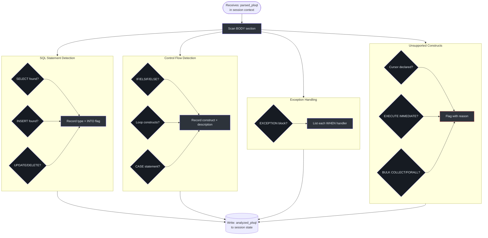
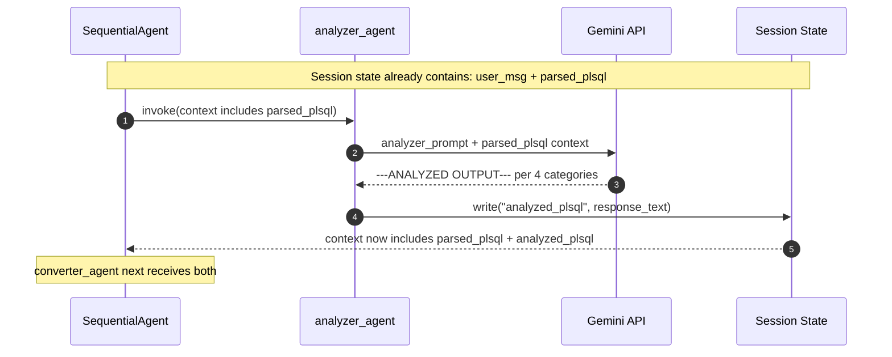

# Analyzer Agent

## Why This Agent Exists

The Converter Agent faces a complex mapping problem: PL/SQL has constructs that map differently to C# depending on context. An `IF` block maps to `if/else if/else`. A `NO_DATA_FOUND` exception maps to a `catch` block. A cursor maps to... nothing in MVP0, and needs a `// TODO` comment.

The Analyzer exists so the Converter doesn't have to **discover** and **map** at the same time. By the time the Converter sees the code, it already has a structured annotation: "here are the SQL statements, here is the control flow, here are the exceptions, here are the unsupported constructs." The Converter can then focus purely on the rendering task.

**5 Whys — Why separate Analysis from Conversion?**
1. Combined tasks in one prompt compete for token budget and attention
2. Analysis output is independently auditable (humans can inspect what was found before conversion)
3. A future linter or migration-report tool could consume `analyzed_plsql` directly
4. The LLM is better at focused categorization than simultaneous categorization + code generation
5. Stage-level unit tests can mock `parsed_plsql` and verify `analyzed_plsql` in isolation

---

## Agent Configuration

**Source file**: `plsql_converter/agents/analyzer_agent.py`

```python
analyzer_agent = LlmAgent(
    name="analyzer_agent",
    model="gemini-2.5-flash-lite",
    instruction=_ANALYZER_INSTRUCTION,   # loaded from analyzer_prompt.txt
    description="Analyzes the parsed PL/SQL structure and annotates its logical components: "
                "SQL statements (SELECT/INSERT/UPDATE/DELETE), control flow constructs "
                "(IF/ELSE, loops), exception handling blocks, and flags unsupported constructs "
                "such as cursors and dynamic SQL.",
    output_key="analyzed_plsql",
)
```

*Source: `plsql_converter/agents/analyzer_agent.py:9-20`*

| Property | Value |
|----------|-------|
| ADK type | `LlmAgent` |
| Model | `gemini-2.5-flash-lite` |
| Input read from session | `parsed_plsql` (written by Parser) |
| Output key | `analyzed_plsql` |
| Position in pipeline | Stage 2 of 4 |
| Has tools | No |
| Prompt file | `plsql_converter/prompts/analyzer_prompt.txt` |

---

## The Four Annotation Categories

The Analyzer organizes findings into four named sections. Each section has a precise structure that the Converter is designed to read.

### 1. SQL_STATEMENTS

Identifies every DML statement embedded in the procedure body.

**Fields per entry:**  
- `TYPE`: `SELECT`, `INSERT`, `UPDATE`, or `DELETE`
- `INTO`: `yes` / `no` — distinguishes `SELECT INTO` (fetch into variables) from regular SELECT
- `SQL`: The raw SQL text verbatim

**Why the INTO flag matters**: A `SELECT INTO` in PL/SQL maps to C# output parameter binding — a fundamentally different C# pattern than a query that returns a result set. The Converter uses this flag to generate the correct TODO comment.

*Source: `plsql_converter/prompts/analyzer_prompt.txt:5-8`*

### 2. CONTROL_FLOW

Catalogs all branching and iteration constructs:

| PL/SQL Construct | What the Analyzer Records |
|-----------------|--------------------------|
| `IF / ELSIF / ELSE` | Condition text and nesting |
| `LOOP` (basic) | Exit condition via `EXIT WHEN` |
| `FOR LOOP` | Range or cursor loop |
| `WHILE LOOP` | Condition expression |
| `EXIT WHEN` | The break condition |
| `CASE` | CASE expression or searched CASE |

*Source: `plsql_converter/prompts/analyzer_prompt.txt:10-14`*

### 3. EXCEPTION_HANDLING

Lists every `WHEN <exception> THEN` block in the `EXCEPTION` section:

| Field | Example |
|-------|---------|
| Exception name | `NO_DATA_FOUND`, `INVALID_NUMBER`, `OTHERS` |
| Handler action | Brief description of what the block does |

This maps directly to `catch` blocks in the generated C#. `OTHERS` becomes `catch (Exception ex)`.

*Source: `plsql_converter/prompts/analyzer_prompt.txt:16-18`*

### 4. UNSUPPORTED_CONSTRUCTS

**MVP0 exclusions** — constructs the Converter cannot fully translate and must flag with `// TODO`:

| PL/SQL Construct | Why Flagged |
|-----------------|-------------|
| Explicit cursors (`CURSOR c IS SELECT ...`) | Requires DataReader/IEnumerable pattern — not generated in MVP0 |
| `EXECUTE IMMEDIATE` | Dynamic SQL is a security and complexity boundary |
| `BULK COLLECT / FORALL` | Batch DML with array binding — no direct C# equivalent in MVP0 |

*Source: `plsql_converter/prompts/analyzer_prompt.txt:20-24`*

---

## Output Schema

```
---ANALYZED OUTPUT---
SQL_STATEMENTS:
  - TYPE: <SELECT|INSERT|UPDATE|DELETE> | INTO: <yes|no> | SQL: <raw sql text>
CONTROL_FLOW:
  - <construct_type>: <brief description>
EXCEPTION_HANDLING:
  - WHEN <exception_name>: <what the handler does>
UNSUPPORTED_CONSTRUCTS:
  - <construct>: <reason it is flagged>
---END ANALYZED OUTPUT---
```

If any category has no entries: `NONE` is written for that section.

*Source: `plsql_converter/prompts/analyzer_prompt.txt:25-35`*

### Concrete Example

For the `calculate_interest_breakdown` procedure from `OLD_README.md:228-291`:

```
---ANALYZED OUTPUT---
SQL_STATEMENTS:
  - TYPE: SELECT | INTO: no | SQL: SELECT v_year AS year_number, v_opening_bal AS opening_balance...
CONTROL_FLOW:
  - IF/ELSIF: Input validation — p_tenure <= 0, p_rate <= 0 OR > 100, p_amount <= 0
  - FOR LOOP: Iterates i from 1 to p_tenure, building interest breakdown table
EXCEPTION_HANDLING:
  - WHEN INVALID_NUMBER: Raises application error -20010
  - WHEN OTHERS: Raises application error -20099 with SQLERRM
UNSUPPORTED_CONSTRUCTS:
  - SYS_REFCURSOR (p_result OUT): Cannot return ref cursor in MVP0, needs DataTable or List<T>
  - TABLE(v_table): PL/SQL collection TO TABLE operator has no direct C# equivalent
---END ANALYZED OUTPUT---
```

---

## Internal Decision Tree



---

## Sequence in Pipeline



---

## Invariants & Assumptions

| # | Invariant | Source |
|---|-----------|--------|
| 1 | All 4 sections always present; empty sections use `NONE` | `analyzer_prompt.txt:37` |
| 2 | SQL type is always one of SELECT/INSERT/UPDATE/DELETE | PL/SQL DML grammar |
| 3 | INTO flag is binary: `yes` or `no` | `analyzer_prompt.txt:8` |
| 4 | Unsupported constructs are an MVP0-fixed list, not inferred | `analyzer_prompt.txt:20-24` |
| 5 | Analyzer does NOT generate any C# — analysis only | Design invariant |

---

## References

| Item | Location |
|------|----------|
| Agent definition | [`plsql_converter/agents/analyzer_agent.py`](../../plsql_converter/agents/analyzer_agent.py) |
| Prompt file | [`plsql_converter/prompts/analyzer_prompt.txt`](../../plsql_converter/prompts/analyzer_prompt.txt) |
| Orchestrator wiring | [`plsql_converter/agent.py:15`](../../plsql_converter/agent.py) |
| Previous stage | [`docs/agents/parser-agent.md`](./parser-agent.md) |
| Next stage | [`docs/agents/converter-agent.md`](./converter-agent.md) |
