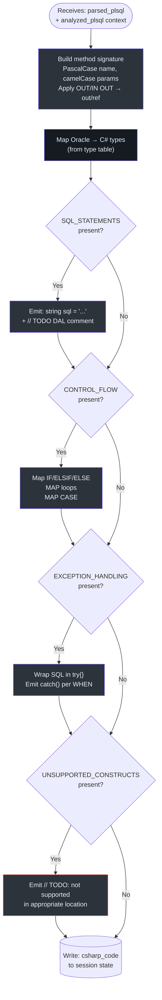
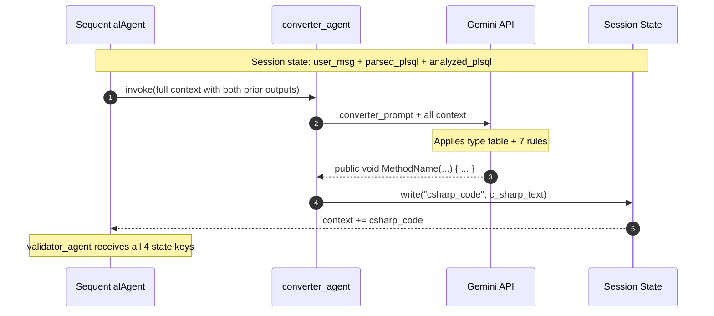

# Converter Agent

## Why This Agent Exists

The Converter is the core translation engine. By Stage 3, the pipeline has already answered "what exists in this PL/SQL?" (Parser) and "what categories of constructs are present?" (Analyzer). The Converter's sole responsibility is: **render all of that knowledge as valid C#**.

It is the most prompt-complex agent in the pipeline, containing the full Oracle → C# type mapping table, 7 conversion rules, a parameter direction mapping, and a concrete output example — all designed to constrain the LLM to produce consistent, compilable output.

---

## Agent Configuration

**Source file**: `plsql_converter/agents/converter_agent.py`

```python
converter_agent = LlmAgent(
    name="converter_agent",
    model="gemini-2.5-flash-lite",
    instruction=_CONVERTER_INSTRUCTION,   # loaded from converter_prompt.txt
    description="Converts the parsed and analyzed PL/SQL structure into a compilable C# method body. "
                "Maps Oracle types to C# types, converts control flow, wraps SQL as raw string variables, "
                "converts exception blocks to try/catch, and flags unsupported constructs with TODO comments.",
    output_key="csharp_code",
)
```

*Source: `plsql_converter/agents/converter_agent.py:9-19`*

| Property | Value |
|----------|-------|
| ADK type | `LlmAgent` |
| Model | `gemini-2.5-flash-lite` |
| Input read from session | `parsed_plsql` + `analyzed_plsql` |
| Output key | `csharp_code` |
| Position in pipeline | Stage 3 of 4 |
| Has tools | No |
| Prompt file | `plsql_converter/prompts/converter_prompt.txt` |

---

## The 7 Conversion Rules

These rules are embedded verbatim in `converter_prompt.txt` and govern all output. The Converter is instructed to follow them **strictly**.

*Source: `plsql_converter/prompts/converter_prompt.txt:23-40`*

### Rule 1: Method Signature Casing
- Method name: **PascalCase** (e.g., `get_employee` → `GetEmployee`)
- Parameter names: **camelCase** (e.g., `p_emp_id` → `pEmpId`)
- Access modifier: always `public`

### Rule 2: SQL Statements → Raw String Variables

Every SQL statement found in the Analyzer's `SQL_STATEMENTS` list is wrapped as:

```csharp
string sql = "SELECT col FROM table WHERE id = :pParam";
// TODO: Execute sql using your data access layer (e.g., Dapper, ADO.NET)
```

**Why raw strings?** Oracle SQL syntax (`:=` bind params, `ROWNUM`, `CONNECT BY`) is not directly executable by ADO.NET or Dapper without modification. Preserving it as a string with a TODO is the safest approach — it preserves intent without generating broken code.

### Rule 3: Control Flow Mapping

| PL/SQL | C# |
|--------|-----|
| `IF ... THEN` | `if (...) {` |
| `ELSIF ... THEN` | `else if (...) {` |
| `ELSE` | `else {` |
| `END IF;` | `}` |
| `FOR i IN 1..n LOOP` | `for (int i = 1; i <= n; i++) {` |
| `WHILE condition LOOP` | `while (condition) {` |
| `LOOP ... EXIT WHEN cond;` | `while (true) { ... if (cond) break; }` |
| `END LOOP;` | `}` |
| `CASE ... WHEN` | `switch (...) { case ...: }` |

*Source: `plsql_converter/prompts/converter_prompt.txt:28-33`*

### Rule 4: Exception Handling Mapping

| PL/SQL | C# |
|--------|-----|
| `EXCEPTION` block | Wraps preceding SQL in `try { }` |
| `WHEN NO_DATA_FOUND THEN` | `catch (Exception) { /* no data */ }` |
| `WHEN INVALID_NUMBER THEN` | `catch (InvalidCastException)` |
| `WHEN OTHERS THEN` | `catch (Exception ex)` |
| `RAISE_APPLICATION_ERROR(n, msg)` | `throw new Exception(msg)` |

*Source: `plsql_converter/prompts/converter_prompt.txt:33-36`*

### Rule 5: Assignment Operator
- PL/SQL `:=` → C# `=`

### Rule 6: NULL Checks
- `IS NULL` → `== null`
- `IS NOT NULL` → `!= null`

### Rule 7: Unsupported Constructs → TODO Comments

Constructs flagged by the Analyzer as `UNSUPPORTED_CONSTRUCTS` receive:

```csharp
// TODO: [Cursor/Dynamic SQL] not supported in MVP0 — review manually
```

*Source: `plsql_converter/prompts/converter_prompt.txt:39-40`*

---

## Oracle → C# Type Mapping Table

This table is embedded in the Converter prompt and applied to all parameters and local variable declarations.

*Source: `plsql_converter/prompts/converter_prompt.txt:5-16`*

| Oracle Type | C# Type | Notes |
|-------------|---------|-------|
| `NUMBER` | `decimal` | Default for unspecified precision |
| `NUMBER(n,0)` | `int` | Integer-precision NUMBER |
| `VARCHAR2` | `string` | Any length |
| `CHAR` | `string` | Fixed-length maps to mutable string |
| `DATE` | `DateTime` | No time zone |
| `TIMESTAMP` | `DateTime` | Fractional seconds mapped |
| `BOOLEAN` | `bool` | PL/SQL BOOLEAN is not standard SQL |
| `CLOB` | `string` | Large text |
| `BLOB` | `byte[]` | Binary data |
| `INTEGER` | `int` | Explicit integer |
| `FLOAT` | `double` | Floating point |
| `BINARY_DOUBLE` | `double` | IEEE 754 double |

## Parameter Direction Mapping

*Source: `plsql_converter/prompts/converter_prompt.txt:18-21`*

| PL/SQL Direction | C# Keyword | Example |
|-----------------|------------|---------|
| `IN` | *(none — regular parameter)* | `decimal pAmount` |
| `OUT` | `out` | `out string pName` |
| `IN OUT` | `ref` | `ref decimal pBalance` |

---

## Output Contract

The Converter's output is a **bare C# method body** — no `using` statements, no `namespace`, no class declaration.

```
Start directly with the method signature.
Return ONLY the C# method body.
```

*Source: `plsql_converter/prompts/converter_prompt.txt:42-44`*

The prompt includes a concrete output anchor example:

```csharp
public void MethodName(decimal pParam1, out string pParam2)
{
    try
    {
        string sql = "SELECT col FROM table WHERE id = :id";
        // TODO: Execute sql using your data access layer (e.g., Dapper, ADO.NET)
    }
    catch (Exception)
    {
        pParam2 = "NOT FOUND";
    }
}
```

*Source: `plsql_converter/prompts/converter_prompt.txt:46-60`*

---

## End-to-End Conversion Example

**Input**: `get_employee` procedure with 1 IN param, 2 OUT params, SELECT INTO, NO_DATA_FOUND handler.

**After Parser** (`parsed_plsql`):
```
PROCEDURE_NAME: get_employee
PARAMETERS:
  - p_emp_id | IN | NUMBER
  - p_name | OUT | VARCHAR2
  - p_salary | OUT | NUMBER
BODY: SELECT emp_name, salary INTO p_name, p_salary FROM employees WHERE emp_id = p_emp_id;
EXCEPTION WHEN NO_DATA_FOUND THEN p_name := 'NOT FOUND'; p_salary := 0;
```

**After Analyzer** (`analyzed_plsql`):
```
SQL_STATEMENTS:
  - TYPE: SELECT | INTO: yes | SQL: SELECT emp_name, salary FROM employees WHERE emp_id = p_emp_id
EXCEPTION_HANDLING:
  - WHEN NO_DATA_FOUND: Sets p_name='NOT FOUND', p_salary=0
UNSUPPORTED_CONSTRUCTS: NONE
```

**Converter output** (`csharp_code`):
```csharp
public void GetEmployee(decimal pEmpId, out string pName, out decimal pSalary)
{
    try
    {
        string sql = "SELECT emp_name, salary FROM employees WHERE emp_id = :pEmpId";
        // TODO: Execute sql using your data access layer (e.g., Dapper, ADO.NET)
        // The INTO clause maps pName and pSalary to output parameters of your data access method.
    }
    catch (Exception)
    {
        pName = "NOT FOUND";
        pSalary = 0;
    }
}
```

---

## Conversion Decision Tree



---

## Converter in the Pipeline Sequence



---

## Invariants & Assumptions

| # | Invariant | Source |
|---|-----------|--------|
| 1 | Output MUST NOT contain `using`, `namespace`, or `class` declarations | `converter_prompt.txt:43` |
| 2 | Method name MUST be PascalCase | `converter_prompt.txt:24` |
| 3 | All SQL is preserved as raw strings — never transpiled | `converter_prompt.txt:25-27` |
| 4 | Unsupported constructs are never silently dropped | `converter_prompt.txt:39-40` |
| 5 | Type mapping table is authoritative — all Oracle types in the table produce deterministic C# types | `converter_prompt.txt:5-16` |

---

## References

| Item | Location |
|------|----------|
| Agent definition | [`plsql_converter/agents/converter_agent.py`](../../plsql_converter/agents/converter_agent.py) |
| Prompt file | [`plsql_converter/prompts/converter_prompt.txt`](../../plsql_converter/prompts/converter_prompt.txt) |
| Orchestrator wiring | [`plsql_converter/agent.py:16`](../../plsql_converter/agent.py) |
| Previous stage | [`docs/agents/analyzer-agent.md`](./analyzer-agent.md) |
| Next stage | [`docs/agents/validator-agent.md`](./validator-agent.md) |
