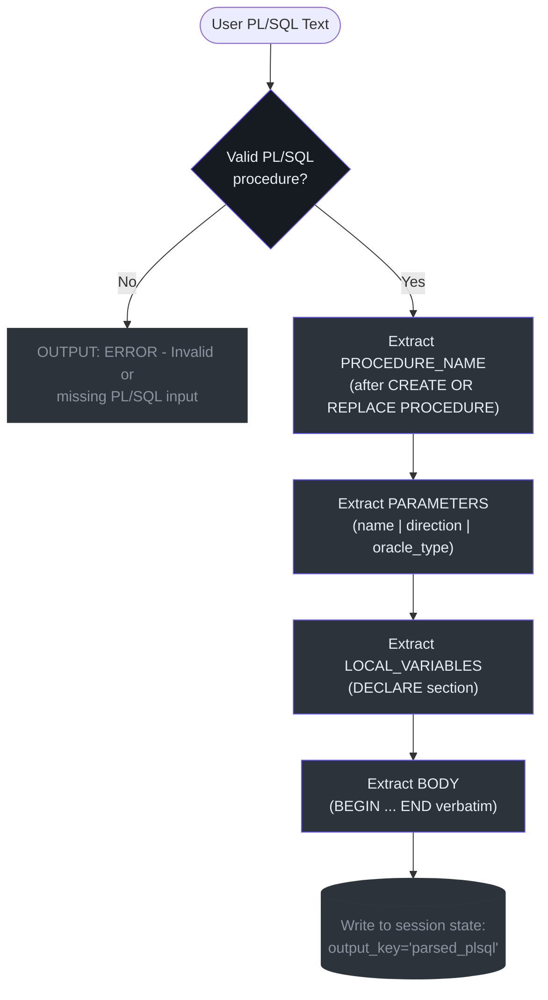
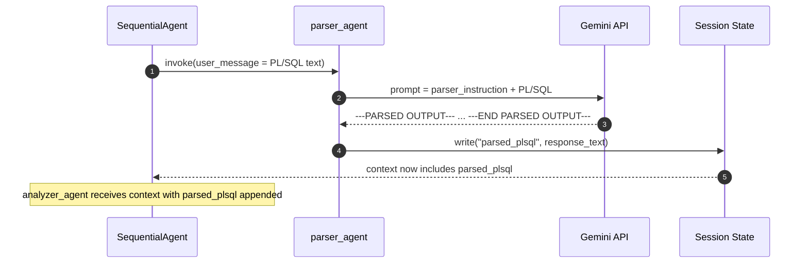

# Parser Agent

## Why This Agent Exists

Before any conversion can happen, the system must answer a deceptively simple question: **what exactly is in this PL/SQL?** The Converter cannot know what C# types to emit if it doesn't know what Oracle types were declared. The Analyzer cannot identify control flow if it doesn't know where the procedure body begins.

The Parser Agent exists to separate **extraction** from **interpretation**. It is deliberately forbidden from doing any conversion logic — it only reads and structures what is already written in the source.

> "Do NOT attempt to convert or interpret the logic. Just extract and structure the information."
> — `plsql_converter/prompts/parser_prompt.txt:24`

---

## Agent Configuration

**Source file**: `plsql_converter/agents/parser_agent.py`

```python
parser_agent = LlmAgent(
    name="parser_agent",
    model="gemini-2.5-flash-lite",
    instruction=_PARSER_INSTRUCTION,   # loaded from parser_prompt.txt at import time
    description="Parses a raw PL/SQL stored procedure and extracts structured information: "
                "procedure name, parameters (name, type, direction), local variable declarations, "
                "and the raw procedure body.",
    output_key="parsed_plsql",
)
```

*Source: `plsql_converter/agents/parser_agent.py:9-19`*

| Property | Value |
|----------|-------|
| ADK type | `LlmAgent` |
| Model | `gemini-2.5-flash-lite` |
| Output key | `parsed_plsql` |
| Position in pipeline | Stage 1 of 4 |
| Has tools | No |
| Prompt file | `plsql_converter/prompts/parser_prompt.txt` |

---

## What It Extracts

The Parser is instructed to identify four structured sections from the input PL/SQL:

### 1. Procedure Name
The identifier appearing after `CREATE OR REPLACE PROCEDURE`. This becomes the PascalCase C# method name in a later stage.

### 2. Parameters
Each parameter's:
- **Name** — the identifier (e.g., `p_emp_id`)
- **Direction** — `IN`, `OUT`, or `IN OUT`
- **Oracle data type** — e.g., `NUMBER`, `VARCHAR2(100)`, `SYS_REFCURSOR`

### 3. Local Variables
Any variables declared in the `DECLARE` block (the section between `AS` / `IS` and `BEGIN`):
- **Variable name**
- **Oracle type**
- **Default value** (optional)

### 4. Procedure Body
The raw text between `BEGIN` and the closing `END <procedure_name>;`. Passed forward verbatim — no modification.

---

## Output Schema

The Parser outputs delimited structured text, not JSON. This is by design: the downstream Analyzer and Converter read this as part of their LLM context window.

```
---PARSED OUTPUT---
PROCEDURE_NAME: <name>
PARAMETERS:
  - <param_name> | <direction> | <oracle_type>
LOCAL_VARIABLES:
  - <var_name> | <oracle_type> [| <default_value>]
BODY:
<raw procedure body here>
---END PARSED OUTPUT---
```

*Source: `plsql_converter/prompts/parser_prompt.txt:14-22`*

### Concrete Example

**Input PL/SQL:**
```sql
CREATE OR REPLACE PROCEDURE get_employee (
    p_emp_id   IN  NUMBER,
    p_name     OUT VARCHAR2,
    p_salary   OUT NUMBER
) AS
BEGIN
    SELECT emp_name, salary
    INTO p_name, p_salary
    FROM employees
    WHERE emp_id = p_emp_id;
EXCEPTION
    WHEN NO_DATA_FOUND THEN
        p_name := 'NOT FOUND';
        p_salary := 0;
END get_employee;
```

**Expected `parsed_plsql` output:**
```
---PARSED OUTPUT---
PROCEDURE_NAME: get_employee
PARAMETERS:
  - p_emp_id | IN | NUMBER
  - p_name | OUT | VARCHAR2
  - p_salary | OUT | NUMBER
LOCAL_VARIABLES:
  NONE
BODY:
    SELECT emp_name, salary
    INTO p_name, p_salary
    FROM employees
    WHERE emp_id = p_emp_id;
EXCEPTION
    WHEN NO_DATA_FOUND THEN
        p_name := 'NOT FOUND';
        p_salary := 0;
---END PARSED OUTPUT---
```

---

## Internal Logic Flow



---

## Error Handling

If the input is not a recognizable PL/SQL stored procedure, the Parser outputs:

```
ERROR: Invalid or missing PL/SQL stored procedure input.
```

*Source: `plsql_converter/prompts/parser_prompt.txt:25-26`*

> **Important**: This error string is written to `parsed_plsql` in session state. The downstream Analyzer will receive this error text as its input. There is no hard stop mechanism in the current pipeline — it is the LLM's responsibility in each subsequent stage to recognize and propagate the error gracefully.

---

## Invariants & Assumptions

| # | Invariant | Source |
|---|-----------|--------|
| 1 | Parser always produces output — never silently fails | `parser_prompt.txt:25-26` |
| 2 | Parameter direction is always one of: IN, OUT, IN OUT | Oracle PL/SQL grammar |
| 3 | BODY is passed verbatim — no interpretation | `parser_prompt.txt:24` |
| 4 | Prompt is loaded once at module import, not per request | `parser_agent.py:5-7` |
| 5 | Output must be delimited by `---PARSED OUTPUT---` markers | `parser_prompt.txt:14,22` |

---

## Interaction with Other Stages



---

## References

| Item | Location |
|------|----------|
| Agent definition | [`plsql_converter/agents/parser_agent.py`](../../plsql_converter/agents/parser_agent.py) |
| Prompt file | [`plsql_converter/prompts/parser_prompt.txt`](../../plsql_converter/prompts/parser_prompt.txt) |
| Orchestrator wiring | [`plsql_converter/agent.py:13-14`](../../plsql_converter/agent.py) |
| Analyzer agent (next stage) | [`docs/agents/analyzer-agent.md`](./analyzer-agent.md) |
