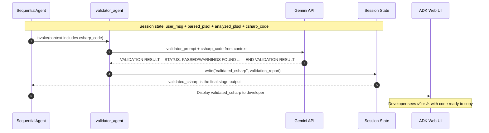

# Validator Agent

## Why This Agent Exists

The Converter is an LLM inference step — which means output quality is probabilistic. Even with a tightly constrained prompt, the model might occasionally:
- Produce unbalanced braces due to complex nesting
- Leak a PL/SQL token like `:=` or `DECLARE` through the conversion
- Generate an invalid method signature

The Validator Agent is the pipeline's **quality gate**. It performs three targeted structural checks on the Converter's output and reports findings to the developer before they copy the code into their IDE.

**Critical design decision**: The Validator **always returns the code**, even if it finds issues. This is intentional. It is a developer-assistance tool, not a blocking gatekeeper. The human sees warnings alongside the best-effort output and can fix issues manually.

> "If issues found: Return ⚠️ VALIDATION WARNINGS, list each issue clearly, then still return the best-effort C# code so the developer can review it manually."
> — `plsql_converter/prompts/validator_prompt.txt:23`

---

## Agent Configuration

**Source file**: `plsql_converter/agents/validator_agent.py`

```python
validator_agent = LlmAgent(
    name="validator_agent",
    model="gemini-2.5-flash-lite",
    instruction=_VALIDATOR_INSTRUCTION,   # loaded from validator_prompt.txt
    description="Performs a lightweight structural validation of the generated C# method body. "
                "Checks for: valid method signature, balanced braces, and any leaked PL/SQL syntax "
                "(e.g., ':=', 'BEGIN', 'END;'). Returns the validated code with a PASSED or WARNINGS status.",
    output_key="validated_csharp",
)
```

*Source: `plsql_converter/agents/validator_agent.py:9-19`*

| Property | Value |
|----------|-------|
| ADK type | `LlmAgent` |
| Model | `gemini-2.5-flash-lite` |
| Input read from session | `csharp_code` (written by Converter) |
| Output key | `validated_csharp` |
| Position in pipeline | Stage 4 of 4 (final) |
| Has tools | No |
| Prompt file | `plsql_converter/prompts/validator_prompt.txt` |

---

## The Three Checks

### Check 1: Method Signature Validation

The validator examines whether the generated code begins with a syntactically valid C# method signature.

**Pass conditions:**
- Starts with an access modifier: `public`, `private`, `protected`, `internal`
- Followed by a return type: `void`, `int`, `decimal`, `string`, `DateTime`, `bool`, `byte[]`, or similar
- Contains a method name in PascalCase
- Has a parameter list wrapped in `(...)` with valid C# types
- Valid modifiers on parameters: `out`, `ref`

*Source: `plsql_converter/prompts/validator_prompt.txt:5-8`*

### Check 2: Brace Balance

The validator **counts** every `{` and `}` in the code and confirms they are equal.

```
Opening braces: { count } = Closing braces: } count
```

This is a simple but effective check. Unbalanced braces guarantee a compile error. Complex nesting (try/catch inside if/else inside loops) is a common source of LLM miscounting.

*Source: `plsql_converter/prompts/validator_prompt.txt:9-11`*

### Check 3: PL/SQL Leak Detection

Scans the generated C# for Oracle-specific syntax that should have been converted but wasn't.

*Source: `plsql_converter/prompts/validator_prompt.txt:13-19`*

| PL/SQL Token | Why It's a Leak | Expected C# Form |
|-------------|----------------|-----------------|
| `:=` | PL/SQL assignment operator | `=` |
| Standalone `BEGIN` | PL/SQL block delimiter | Not applicable in C# method bodies |
| Standalone `END;` | PL/SQL block terminator | Closing `}` |
| `DECLARE` | PL/SQL declaration section keyword | Variable declarations inline in C# |
| `DBMS_OUTPUT` | Oracle-specific print function | `Console.WriteLine` or logging |
| `v_` variable prefixes | PL/SQL naming convention, not converted | Should be renamed (e.g., `vTable` → `table`) |

> **Important**: The `v_` prefix check is heuristic — it looks for variable names that start with `v_` that may not have been renamed during conversion. This can produce false positives if the developer intentionally uses `v_` naming in C#.

---

## Output Schema

The Validator's final output is the **user-facing response** — what appears in the ADK Web chat. It is structured as:

```
---VALIDATION RESULT---
STATUS: PASSED | WARNINGS FOUND
ISSUES:
  - <issue description> (or NONE)
CODE:
<the C# method body>
---END VALIDATION RESULT---
```

*Source: `plsql_converter/prompts/validator_prompt.txt:25-32`*

### Pass Scenario

```
---VALIDATION RESULT---
STATUS: PASSED
ISSUES:
  - NONE
CODE:
public void GetEmployee(decimal pEmpId, out string pName, out decimal pSalary)
{
    try
    {
        string sql = "SELECT emp_name, salary FROM employees WHERE emp_id = :pEmpId";
        // TODO: Execute sql using your data access layer (e.g., Dapper, ADO.NET)
    }
    catch (Exception)
    {
        pName = "NOT FOUND";
        pSalary = 0;
    }
}
---END VALIDATION RESULT---
```

### Warning Scenario

```
---VALIDATION RESULT---
STATUS: WARNINGS FOUND
ISSUES:
  - Brace mismatch: 3 opening braces, 4 closing braces
  - PL/SQL leak detected: ':=' found on line 7
CODE:
public void GetEmployee(decimal pEmpId, out string pName, out decimal pSalary)
{
    // ... (code with issues returned for manual review)
}
---END VALIDATION RESULT---
```

---

## Validation State Machine

```mermaid
stateDiagram-v2
    [*] --> Receiving: csharp_code from session state

    Receiving --> CheckSignature: Begin Check 1

    CheckSignature --> SignatureOK: Valid public method signature
    CheckSignature --> SignatureFail: Missing/invalid signature

    SignatureOK --> CheckBraces: Begin Check 2
    SignatureFail --> CheckBraces: Record issue, continue

    CheckBraces --> BracesOK: open_count == close_count
    CheckBraces --> BracesFail: Mismatch detected

    BracesOK --> CheckLeaks: Begin Check 3
    BracesFail --> CheckLeaks: Record issue, continue

    CheckLeaks --> LeaksOK: No PL/SQL tokens found
    CheckLeaks --> LeaksFail: Found :=, BEGIN, END;, etc.

    LeaksOK --> EmitPassed: All checks passed
    LeaksFail --> EmitWarnings: One or more issues

    SignatureFail --> EmitWarnings
    BracesFail --> EmitWarnings

    EmitPassed --> [*]: ✅ VALIDATION PASSED\n+ code written to validated_csharp
    EmitWarnings --> [*]: ⚠️ VALIDATION WARNINGS\n+ issue list + code written to validated_csharp
```



---

## Validator in the Full Pipeline



---

## Why the Validator Is an LLM Agent (Not a Code Parser)

An alternative design would use a real C# parser (e.g., Microsoft Roslyn) to validate the generated code. The current design uses an LLM for validation. Here are the trade-offs:

| Aspect | LLM Validator (current) | Roslyn-based Validator |
|--------|------------------------|----------------------|
| Setup complexity | Zero — same model, same pattern | Requires .NET runtime, Roslyn package |
| False positives | Possible (v_ prefix heuristic) | None — syntactic ground truth |
| Coverage | Heuristic text scan | Full parse tree |
| Speed | ~1-2s LLM call | ~100-500ms local |
| Dependencies | `google-adk` only | `microsoft.codeanalysis` |
| Cross-platform | Yes | Yes |

**Decision**: Use LLM for MVP0 to avoid adding a .NET runtime dependency to a Python project. Roslyn validation is a natural MVP1+ upgrade.

---

## Invariants & Assumptions

| # | Invariant | Source |
|---|-----------|--------|
| 1 | Validator ALWAYS returns the code block — never withholds | `validator_prompt.txt:22-23` |
| 2 | Output always uses structured `---VALIDATION RESULT---` delimiters | `validator_prompt.txt:25-32` |
| 3 | STATUS is either `PASSED` or `WARNINGS FOUND` — no other values | `validator_prompt.txt:27` |
| 4 | `validated_csharp` is the last `output_key` — it is the user-facing response | `validator_agent.py:18` |
| 5 | v_ prefix detection is heuristic — may produce false positives | Inferred from `validator_prompt.txt:19` |

---

## References

| Item | Location |
|------|----------|
| Agent definition | [`plsql_converter/agents/validator_agent.py`](../../plsql_converter/agents/validator_agent.py) |
| Prompt file | [`plsql_converter/prompts/validator_prompt.txt`](../../plsql_converter/prompts/validator_prompt.txt) |
| Orchestrator wiring | [`plsql_converter/agent.py:17`](../../plsql_converter/agent.py) |
| Previous stage | [`docs/agents/converter-agent.md`](./converter-agent.md) |
| Architecture overview | [`docs/architecture.md`](../architecture.md) |
