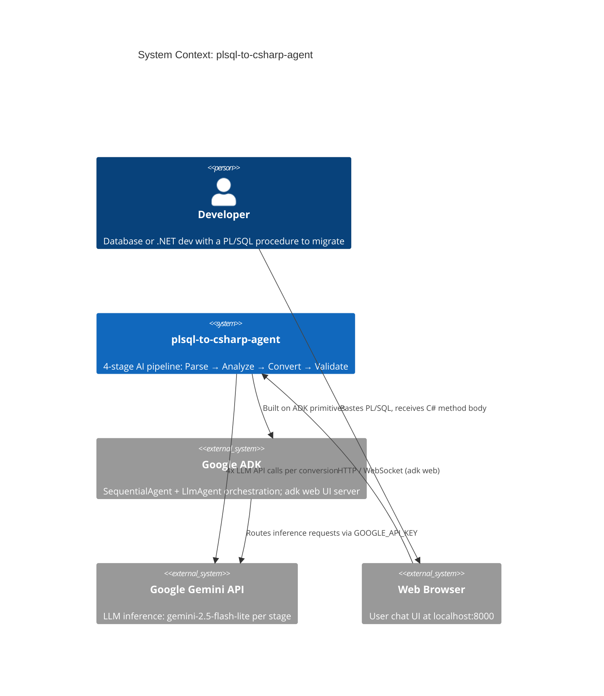
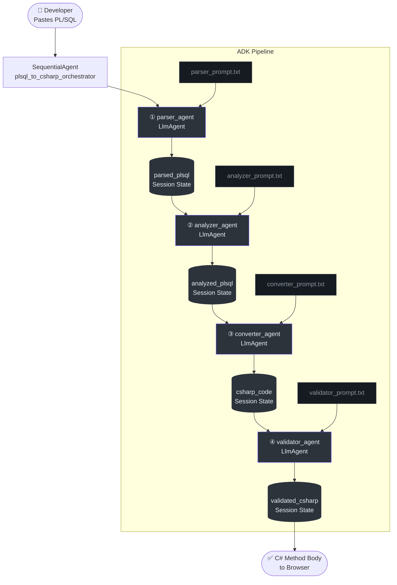
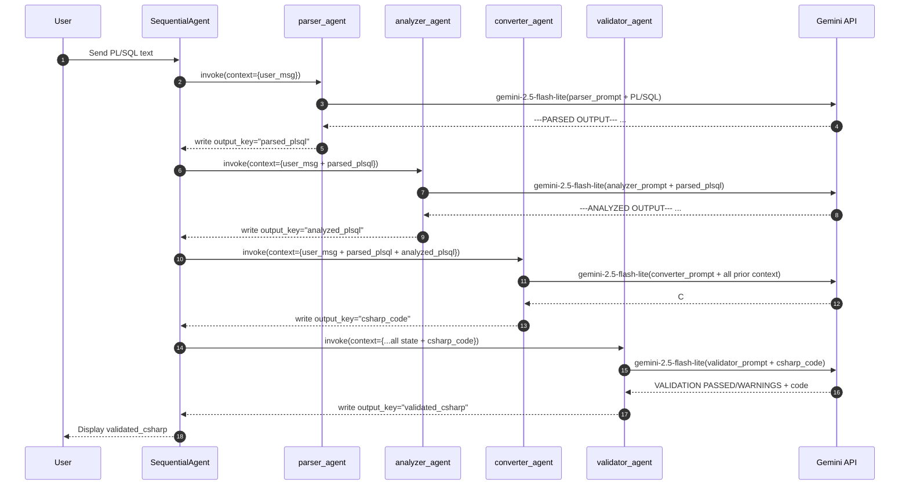

# System Architecture

## Why This Architecture Exists

Legacy Oracle PL/SQL stored procedures represent years of business logic that must survive migration to .NET backends. Manual conversion is error-prone and time-consuming. The `plsql-to-csharp-agent` automates this by decomposing the problem into four distinct cognitive tasks — parsing, analysis, conversion, and validation — each delegated to a specialist LLM agent.

The core insight: **a single mega-prompt trying to "convert PL/SQL to C#" will conflate separable concerns** and produce hallucinated output. Splitting the pipeline forces each agent to do one thing well, with its output verified by the next stage.

---

## C4 System Context

The diagram below shows the system from a stakeholder perspective — who uses it, and what external systems it depends on.



---

## Component Architecture

The system has exactly **6 Python source files** and **4 prompt files**. No database, no custom tooling, no REST API layer.

### Source File Map

| File | Role | Key Export |
|------|------|-----------|
| `plsql_converter/__init__.py` | Package surface | Re-exports `root_agent` for ADK discovery |
| `plsql_converter/agent.py` | Orchestrator | `root_agent` (`SequentialAgent`) |
| `plsql_converter/agents/parser_agent.py` | Stage 1 | `parser_agent` (`LlmAgent`) |
| `plsql_converter/agents/analyzer_agent.py` | Stage 2 | `analyzer_agent` (`LlmAgent`) |
| `plsql_converter/agents/converter_agent.py` | Stage 3 | `converter_agent` (`LlmAgent`) |
| `plsql_converter/agents/validator_agent.py` | Stage 4 | `validator_agent` (`LlmAgent`) |

*Source: `plsql_converter/agent.py:1-5` (imports), `plsql_converter/__init__.py:1` (re-export)*

### Pipeline Data-Flow



---

## ADK Session State Threading Model

This is the most important architectural concept to understand.

### How State Flows

Each `LlmAgent` is configured with an `output_key` parameter (`plsql_converter/agents/parser_agent.py:18`). When an agent completes a turn, ADK stores its response text in the session state under that key. Every subsequent agent in the `SequentialAgent` list receives the full session state — including all previously written keys — as additional context in its prompt.

**This means:**
- The **Parser** sees: `{user input}`
- The **Analyzer** sees: `{user input} + parsed_plsql`
- The **Converter** sees: `{user input} + parsed_plsql + analyzed_plsql`
- The **Validator** sees: `{user input} + parsed_plsql + analyzed_plsql + csharp_code`



### Why Output Keys, Not Return Values?

ADK's `SequentialAgent` doesn't pass explicit return values between agents. Instead, it threads accumulated session state. Using named `output_key` slots:

1. Decouples agents from each other — no direct Python coupling
2. Allows any agent to access any prior stage's output
3. The final UI always shows the **last agent's** response, which is the Validator's cleaned output

---

## Prompt Loading Architecture

All four agents load their instructions identically (`parser_agent.py:5-7`):

```python
_PROMPT_PATH = os.path.join(os.path.dirname(__file__), "..", "prompts", "parser_prompt.txt")
with open(_PROMPT_PATH, "r", encoding="utf-8") as f:
    _PARSER_INSTRUCTION = f.read()
```

**Key characteristics:**
- Loaded at **module import time** (not at request time)
- Path is resolved **relative to the agent file's directory** via `__file__`
- Prompt changes require a **process restart** (no hot-reload)
- Encoding is explicitly `utf-8` — safe for SQL strings containing special characters

---

## Design Decisions & Trade-offs

| Decision | Choice Made | Alternative Considered | Rationale |
|----------|-------------|----------------------|-----------|
| Agent count | 4 specialist agents | 1 mega-prompt agent | Prevents concern conflation; each stage debuggable independently |
| Output format | Delimited text (`---PARSED OUTPUT---`) | Structured JSON | Simpler prompt engineering; works natively with LLM text generation |
| Model | `gemini-2.5-flash-lite` (all 4) | Different models per stage | Cost/speed consistency; Flash Lite adequate for all extraction/generation tasks |
| No function tools | Pure text I/O | Function-calling tools | No external lookups needed; all knowledge lives in prompts |
| Validator behavior | Always returns code + status | Block on warnings | Developer-friendly degraded output; human review preferred over silent failure |
| Scope | Method body only | Full class/namespace | Intentional MVP0 constraint; humans integrate the method into their codebase |
| SQL handling | Raw `string sql = "..."` | LINQ generation | Oracle SQL is complex; raw strings + TODO preserve intent safely |

### MVP0 Explicit Non-Goals (Source: `OLD_README.md:35-37`)

- ❌ LINQ conversion (planned MVP1)
- ❌ Class/namespace wrapper
- ❌ Cursors and dynamic SQL full conversion (flagged with `// TODO`)
- ❌ Batch file processing (planned MVP3)

---

## Security Model

| Surface | Risk | Mitigation |
|---------|------|-----------|
| `GOOGLE_API_KEY` | Credential exposure | Stored in `.env`, loaded by `python-dotenv`; not committed to VCS |
| User-supplied PL/SQL | Prompt injection | Prompts strictly instruct agents to parse/convert only; no tool execution |
| LLM output | Code generation errors | Validator checks output structural integrity before surfacing |

> **Note**: The Validator is an LLM agent, not a compiler. It performs heuristic text checks, not syntax tree analysis. Generated C# must be compiled and reviewed by the developer.

---

## Performance Characteristics

Each conversion invokes **4 sequential LLM calls** to the Gemini API. Latency is dominated by LLM inference time.

| Stage | Input size | Output size | Typical latency |
|-------|-----------|-------------|----------------|
| Parser | Full PL/SQL | Structured text extract | ~1-3s |
| Analyzer | Parsed structure | Annotated category list | ~1-3s |
| Converter | Parsed + analyzed | C# method body | ~2-5s |
| Validator | C# method body | Validation report | ~1-2s |
| **Total** | | | **~5-13s per conversion** |

*These are estimates based on model characteristics; actual latency depends on network and API load.*

---

## Roadmap

| Version | Feature |
|---------|---------|
| **MVP0** (current) | Stored Procedures → C# method bodies |
| MVP1 | Functions, LINQ conversion option |
| MVP2 | Triggers, Packages, full Cursor support |
| MVP3 | Batch file processing, CLI mode |

*Source: `OLD_README.md:317-323`*

---

## References

| File | Location |
|------|----------|
| Root agent definition | [`plsql_converter/agent.py`](../plsql_converter/agent.py) |
| Package entrypoint | [`plsql_converter/__init__.py`](../plsql_converter/__init__.py) |
| All agent modules | [`plsql_converter/agents/`](../plsql_converter/agents/) |
| All prompt files | [`plsql_converter/prompts/`](../plsql_converter/prompts/) |
| Project dependencies | [`requirements.txt`](../requirements.txt) |
