# Prompt Engineering Reference

This document is the authoritative reference for all prompt contracts in the `plsql-to-csharp-agent` pipeline. It covers the structure, data schemas, and constraints of each prompt file, as well as how prompts interact across pipeline stages.

---

## Overview: Prompt Architecture Pattern

All four agents follow an identical prompt loading pattern (`parser_agent.py:5-7`):

```python
_PROMPT_PATH = os.path.join(os.path.dirname(__file__), "..", "prompts", "parser_prompt.txt")
with open(_PROMPT_PATH, "r", encoding="utf-8") as f:
    _PARSER_INSTRUCTION = f.read()
```

**Key behaviors:**
- Prompt is loaded **once at module import time**, not per request
- Path is always **relative to the agent file** via `__file__`
- All prompts use `utf-8` encoding
- To update a prompt: edit the `.txt` file, then restart `adk web`

---

## Prompt Inventory

| Prompt File | Agent | Size | Output Key | Delimiter Pair |
|-------------|-------|------|-----------|----------------|
| `parser_prompt.txt` | parser_agent | 1,013 bytes | `parsed_plsql` | `---PARSED OUTPUT---` / `---END PARSED OUTPUT---` |
| `analyzer_prompt.txt` | analyzer_agent | 1,321 bytes | `analyzed_plsql` | `---ANALYZED OUTPUT---` / `---END ANALYZED OUTPUT---` |
| `converter_prompt.txt` | converter_agent | 2,072 bytes | `csharp_code` | *(none — bare C# output)* |
| `validator_prompt.txt` | validator_agent | 1,263 bytes | `validated_csharp` | `---VALIDATION RESULT---` / `---END VALIDATION RESULT---` |

---

## Prompt 1: `parser_prompt.txt`

**Full path**: `plsql_converter/prompts/parser_prompt.txt`  
**Lines**: 27  
**Agent**: `parser_agent`

### Role Declaration

```
You are a PL/SQL Parser. Your ONLY job is to extract structured information from a PL/SQL stored procedure.
```

The word **ONLY** is intentional emphasis — the parser must not attempt conversion. This is the single most important constraint in this prompt.

### Extraction Contract

| Field | Description | Format |
|-------|-------------|--------|
| `PROCEDURE_NAME` | Procedure identifier | Single value |
| `PARAMETERS` | One entry per parameter | `name \| direction \| oracle_type` |
| `LOCAL_VARIABLES` | One entry per declared variable | `var_name \| oracle_type [\| default_value]` |
| `BODY` | Raw text between BEGIN and END | Multi-line verbatim block |

### Output Schema (exact)

```
---PARSED OUTPUT---
PROCEDURE_NAME: <name>
PARAMETERS:
  - <param_name> | <direction> | <oracle_type>
LOCAL_VARIABLES:
  - <var_name> | <oracle_type> [| <default_value>]
BODY:
<raw procedure body here>
---END PARSED OUTPUT---
```

### Error Signal

```
ERROR: Invalid or missing PL/SQL stored procedure input.
```

Emitted instead of the normal output block when the input is not a recognizable PL/SQL stored procedure.

### Prompt Engineering Notes

- Using `|` as field separator (not `:`) avoids collisions with Oracle type syntax (e.g., `VARCHAR2(100)` contains `:` risk is low, `|` is safer).
- "Do NOT attempt to convert or interpret the logic" — explicit instruction prevents the model from helpfully "doing more" and corrupting downstream stages.
- The `[| <default_value>]` bracket notation signals optionality without needing a separate schema.

---

## Prompt 2: `analyzer_prompt.txt`

**Full path**: `plsql_converter/prompts/analyzer_prompt.txt`  
**Lines**: 38  
**Agent**: `analyzer_agent`

### Role Declaration

```
You are a PL/SQL Code Analyzer. You receive structured parsed output from a PL/SQL stored procedure and analyze its logical components.
```

Note: the role declaration explicitly says it **receives** parsed output — grounding the model in the pipeline context.

### Four Annotation Sections

#### SQL_STATEMENTS

```
- TYPE: <SELECT|INSERT|UPDATE|DELETE> | INTO: <yes|no> | SQL: <raw sql text>
```

The `INTO` flag captures `SELECT ... INTO variable` patterns — critical for the Converter to know whether to generate output parameter binding comments.

#### CONTROL_FLOW

```
- <construct_type>: <brief description>
```

Construct types: `IF/ELSIF`, `LOOP`, `FOR LOOP`, `WHILE LOOP`, `EXIT WHEN`, `CASE`.

#### EXCEPTION_HANDLING

```
- WHEN <exception_name>: <what the handler does>
```

Named exceptions map to specific C# catch patterns. `OTHERS` → `catch (Exception ex)`.

#### UNSUPPORTED_CONSTRUCTS (MVP0)

```
- <construct>: <reason it is flagged>
```

Fixed MVP0 list:
- Explicit cursors
- `EXECUTE IMMEDIATE`
- `BULK COLLECT / FORALL`

### Empty Category Protocol

```
If there are none in a category, write: NONE
```

This is essential — it prevents the model from omitting sections entirely, which would break the Converter's expectations about the output structure.

### Output Schema (exact)

```
---ANALYZED OUTPUT---
SQL_STATEMENTS:
  - TYPE: <SELECT|INSERT|UPDATE|DELETE> | INTO: <yes|no> | SQL: <raw sql text>
CONTROL_FLOW:
  - <construct_type>: <brief description>
EXCEPTION_HANDLING:
  - WHEN <exception_name>: <what the handler does>
UNSUPPORTED_CONSTRUCTS:
  - <construct>: <reason it is flagged>
---END ANALYZED OUTPUT---
```

---

## Prompt 3: `converter_prompt.txt`

**Full path**: `plsql_converter/prompts/converter_prompt.txt`  
**Lines**: 61  
**Agent**: `converter_agent`

This is the largest and most complex prompt at 2,072 bytes. It contains three major sections:

### Section A: Oracle → C# Type Mapping Table (lines 5-16)

Embedded as a Markdown table:

```markdown
| Oracle Type       | C# Type     |
|-------------------|-------------|
| NUMBER            | decimal     |
| NUMBER(n,0)       | int         |
| VARCHAR2          | string      |
| CHAR              | string      |
| DATE              | DateTime    |
| TIMESTAMP         | DateTime    |
| BOOLEAN           | bool        |
| CLOB              | string      |
| BLOB              | byte[]      |
```

### Section B: The 7 Conversion Rules (lines 23-40)

Numbered list with strict language. Each rule begins with a category header:

```
1. METHOD SIGNATURE: ...
2. SQL STATEMENTS: ...
3. CONTROL FLOW: ...
4. EXCEPTION HANDLING: ...
5. ASSIGNMENT: ...
6. NULL checks: ...
7. UNSUPPORTED CONSTRUCTS: ...
```

### Section C: Output Format Constraint + Example (lines 42-60)

```
## Output Format
Return ONLY the C# method body — no class, no namespace, no using statements.
Start directly with the method signature.
```

Followed by a `csharp` fenced code block showing the exact expected output format. This is the output **anchor** — the model uses the concrete example to calibrate its output format.

### Prompt Engineering Notes

- No delimiter markers on the converter output — the output IS the code verbatim. Adding delimiters would require stripping them in the next stage.
- The output example doubles as a few-shot prompt, strongly anchoring the model to the expected format.
- "Return ONLY" is repeated twice — once in the rule, once in the format block — a deliberate redundancy to combat model chattiness.

---

## Prompt 4: `validator_prompt.txt`

**Full path**: `plsql_converter/prompts/validator_prompt.txt`  
**Lines**: 33  
**Agent**: `validator_agent`

### Role Declaration

```
You are a C# Code Validator. Your job is to perform a lightweight structural check on generated C# method code.
```

Note: "lightweight structural" sets expectations — this is not a compiler, not Roslyn. It's a heuristic text scan.

### The Three Checks (numbered, explicit)

```
1. METHOD SIGNATURE CHECK
2. BRACE BALANCE CHECK  
3. PLSQL LEAK CHECK
```

### PL/SQL Leak Token List (explicit enumeration, lines 14-19)

```
- :=      (PL/SQL assignment — should be =)
- BEGIN or END; as standalone keywords
- DECLARE keyword
- DBMS_OUTPUT
- v_ variable prefix patterns that were not converted
```

### Return Protocol (lines 21-23)

Two-branch:

```
- If ALL checks pass: Return the C# code exactly as-is, preceded by ✅ VALIDATION PASSED
- If issues found: Return ⚠️ VALIDATION WARNINGS, list each issue clearly, then still return the best-effort C# code
```

The phrase **"still return"** is the key — it makes the never-withhold behavior explicit.

### Output Schema (exact)

```
---VALIDATION RESULT---
STATUS: PASSED | WARNINGS FOUND
ISSUES:
  - <issue description> (or NONE)
CODE:
<the C# method body>
---END VALIDATION RESULT---
```

---

## Inter-Prompt Data Threading Diagram

This diagram shows how the 4 output schemas chain through ADK session state:

```mermaid
flowchart LR
    classDef prompt fill:#2d333b,stroke:#6d5dfc,color:#e6edf3
    classDef key fill:#161b22,stroke:#30363d,color:#8b949e
    classDef schema fill:#2d333b,stroke:#30363d,color:#e6edf3

    PP[parser_prompt.txt\nparser_agent]:::prompt
    PP --> |"output_key:\nparsed_plsql"| SS1[["---PARSED OUTPUT---\nPROCEDURE_NAME: ...\nPARAMETERS: ...\nLOCAL_VARIABLES: ...\nBODY: ..."]]:::schema

    AP[analyzer_prompt.txt\nanalyzer_agent]:::prompt
    SS1 --> AP
    AP --> |"output_key:\nanalyzed_plsql"| SS2[["---ANALYZED OUTPUT---\nSQL_STATEMENTS: ...\nCONTROL_FLOW: ...\nEXCEPTION_HANDLING: ...\nUNSUPPORTED_CONSTRUCTS: ..."]]:::schema

    CP[converter_prompt.txt\nconverter_agent]:::prompt
    SS2 --> CP
    CP --> |"output_key:\ncsharp_code"| SS3[["public void Method(...)\n{\n    ...\n}"]]:::schema

    VP[validator_prompt.txt\nvalidator_agent]:::prompt
    SS3 --> VP
    VP --> |"output_key:\nvalidated_csharp"| SS4[["---VALIDATION RESULT---\nSTATUS: PASSED\nISSUES: NONE\nCODE: ..."]]:::schema
```



---

## Prompt Modification Guide

> These instructions apply when you want to extend or modify a prompt's behavior.

| Goal | File to Edit | Key Consideration |
|------|-------------|-------------------|
| Add a new Oracle type mapping | `converter_prompt.txt` (type table) | Add a row; update this reference doc |
| Support a new unsupported construct | `analyzer_prompt.txt` (UNSUPPORTED section) + `converter_prompt.txt` (Rule 7) | Both files must be consistent |
| Change output delimiter | `parser_prompt.txt` or `analyzer_prompt.txt` | Downstream agents read this text — maintain continuity |
| Add a new PL/SQL leak check | `validator_prompt.txt` (Check 3 token list) | Document expected C# equivalent |
| Change output format | `converter_prompt.txt` (Output Format + example) | Also update the validator's expectations |

**After editing any prompt**: restart `adk web` for changes to take effect (prompts are loaded at import time, `parser_agent.py:5-7`).

---

## Prompt Engineering Patterns Used

| Pattern | Applied In | Purpose |
|---------|-----------|---------|
| Role declaration ("You are a...") | All 4 prompts | Anchors model persona and scope |
| Explicit prohibitions ("Do NOT...") | Parser prompt | Prevents the model from doing too much |
| Numbered rules | Converter prompt | Ensures each rule is addressable |
| Concrete output example | Converter prompt | Few-shot anchoring for consistent format |
| Delimiter markers | Parser, Analyzer, Validator | Machine-parseable output extraction |
| Empty state protocol ("write NONE") | Analyzer prompt | Prevents missing sections |
| Explicit branch protocol | Validator prompt | Defines exact behavior for pass/fail branches |

---

## References

| Item | Location |
|------|----------|
| Parser prompt | [`plsql_converter/prompts/parser_prompt.txt`](../plsql_converter/prompts/parser_prompt.txt) |
| Analyzer prompt | [`plsql_converter/prompts/analyzer_prompt.txt`](../plsql_converter/prompts/analyzer_prompt.txt) |
| Converter prompt | [`plsql_converter/prompts/converter_prompt.txt`](../plsql_converter/prompts/converter_prompt.txt) |
| Validator prompt | [`plsql_converter/prompts/validator_prompt.txt`](../plsql_converter/prompts/validator_prompt.txt) |
| Architecture overview | [`docs/architecture.md`](./architecture.md) |
| Agent wiki pages | [`docs/agents/`](./agents/) |
